# Sweet Order ERD (Entity Relationship Diagram)

## 개요

Sweet Order 플랫폼의 데이터베이스 ERD입니다. 케이크 주문 플랫폼의 핵심 엔티티들과 관계를 정의합니다.

## ERD 다이어그램

```mermaid
erDiagram
    %% 사용자 관련
    User {
        string id PK
        string userId UK
        string email
        string password_hash
        string name
        string phone UK
        string nickname
        string profile_image_url
        boolean is_verified
        datetime created_at
        datetime updated_at
    }

    UserSettings {
        string id PK
        string user_id FK
        boolean chat_notifications
        boolean order_notifications
        boolean push_notifications
        string language
        datetime created_at
        datetime updated_at
    }

    UserAuth {
        string id PK
        string user_id FK
        string provider
        string provider_id
        string access_token
        string refresh_token
        datetime expires_at
        datetime created_at
        datetime updated_at
    }

    UserAgreement {
        string id PK
        string user_id FK
        string agreement_type
        boolean is_agreed
        string version
        datetime agreed_at
        datetime created_at
    }

    LoginSession {
        string id PK
        string user_id FK
        string session_token UK
        string login_method
        string ip_address
        string user_agent
        datetime expires_at
        datetime created_at
        datetime updated_at
    }

    PhoneVerification {
        string id PK
        string phone
        string verification_code
        int attempt_count
        datetime expires_at
        boolean is_verified
        datetime created_at
        datetime updated_at
    }

    PasswordPolicy {
        string id PK
        int min_length
        boolean require_uppercase
        boolean require_lowercase
        boolean require_numbers
        boolean require_special_chars
        int max_attempts
        datetime created_at
        datetime updated_at
    }

    %% 스토어 관련
    Store {
        string id PK
        string name
        string description
        string address
        string phone
        string email
        string business_hours
        json location
        string logo_url
        string banner_url
        float rating
        int review_count
        int order_count
        boolean is_pickup_available
        boolean is_delivery_available
        boolean is_consultation_available
        boolean is_instant_order_available
        string status
        datetime created_at
        datetime updated_at
    }

    StoreCategory {
        string id PK
        string name
        string description
        string icon_url
        int sort_order
        boolean is_active
        datetime created_at
        datetime updated_at
    }

    StoreCategoryMapping {
        string id PK
        string store_id FK
        string category_id FK
        datetime created_at
    }

    %% 상품 관련
    Product {
        string id PK
        string store_id FK
        string name
        string description
        json images
        decimal base_price
        json allergens
        json custom_options
        float rating
        int review_count
        int order_count
        int like_count
        boolean is_pickup_available
        boolean is_delivery_available
        boolean is_consultation_required
        string status
        datetime created_at
        datetime updated_at
    }

    ProductCategory {
        string id PK
        string name
        string description
        string icon_url
        int sort_order
        boolean is_active
        datetime created_at
        datetime updated_at
    }

    ProductCategoryMapping {
        string id PK
        string product_id FK
        string category_id FK
        datetime created_at
    }

    ProductOption {
        string id PK
        string product_id FK
        string name
        string type
        json choices
        boolean is_required
        decimal price_adjustment
        int sort_order
        datetime created_at
        datetime updated_at
    }

    %% 주문 관련
    Order {
        string id PK
        string user_id FK
        string store_id FK
        string status
        decimal total_amount
        string payment_method
        string payment_status
        string payment_id
        json delivery_info
        json pickup_info
        string special_requests
        json custom_data
        datetime order_date
        datetime pickup_date
        datetime delivery_date
        datetime created_at
        datetime updated_at
    }

    OrderStatusHistory {
        string id PK
        string order_id FK
        string status
        string description
        datetime created_at
    }

    OrderItem {
        string id PK
        string order_id FK
        string product_id FK
        int quantity
        decimal unit_price
        decimal total_price
        json selected_options
        json custom_data
        datetime created_at
        datetime updated_at
    }

    %% 장바구니 관련
    Cart {
        string id PK
        string user_id FK
        datetime created_at
        datetime updated_at
    }

    CartItem {
        string id PK
        string cart_id FK
        string product_id FK
        int quantity
        json selected_options
        json custom_data
        datetime created_at
        datetime updated_at
    }

    %% 리뷰 관련
    Review {
        string id PK
        string user_id FK
        string order_id FK
        string product_id FK
        string store_id FK
        int rating
        string content
        json images
        boolean is_verified
        datetime created_at
        datetime updated_at
    }

    ReviewLike {
        string id PK
        string review_id FK
        string user_id FK
        datetime created_at
    }

    %% 좋아요 관련
    UserLike {
        string id PK
        string user_id FK
        string target_type
        string target_id
        datetime created_at
    }

    %% 채팅 관련
    ChatRoom {
        string id PK
        string user_id FK
        string store_id FK
        string last_message
        datetime last_message_at
        datetime created_at
        datetime updated_at
    }

    ChatMessage {
        string id PK
        string chat_room_id FK
        string sender_id FK
        string sender_type
        string content
        string message_type
        json attachments
        boolean is_read
        datetime read_at
        datetime created_at
    }

    %% 알림 관련
    Notification {
        string id PK
        string user_id FK
        string type
        string title
        string content
        json data
        boolean is_read
        datetime created_at
    }

    NotificationSettings {
        string id PK
        string user_id FK
        boolean chat_enabled
        boolean order_enabled
        boolean push_enabled
        datetime created_at
        datetime updated_at
    }

    %% 공지사항 관련
    Notice {
        string id PK
        string store_id FK
        string title
        string content
        string type
        boolean is_active
        datetime created_at
        datetime updated_at
    }

    %% 관계 정의
    User ||--o{ UserAuth : "has"
    User ||--o{ UserAgreement : "agrees"
    User ||--o{ UserSettings : "has"
    User ||--o{ LoginSession : "has"
    User ||--o{ Order : "places"
    User ||--o{ Cart : "has"
    User ||--o{ Review : "writes"
    User ||--o{ UserLike : "likes"
    User ||--o{ ChatRoom : "participates"
    User ||--o{ Notification : "receives"
    User ||--o{ NotificationSettings : "has"

    Store ||--o{ StoreCategoryMapping : "belongs_to"
    Store ||--o{ Product : "sells"
    Store ||--o{ Order : "receives"
    Store ||--o{ Review : "receives"
    Store ||--o{ ChatRoom : "participates"
    Store ||--o{ Notice : "publishes"

    StoreCategory ||--o{ StoreCategoryMapping : "categorizes"

    Product ||--o{ ProductCategoryMapping : "belongs_to"
    Product ||--o{ ProductOption : "has"
    Product ||--o{ OrderItem : "ordered_as"
    Product ||--o{ CartItem : "added_to"
    Product ||--o{ Review : "reviewed"

    ProductCategory ||--o{ ProductCategoryMapping : "categorizes"

    Order ||--o{ OrderItem : "contains"
    Order ||--o{ OrderStatusHistory : "has"
    Order ||--o{ Review : "generates"

    Cart ||--o{ CartItem : "contains"

    Review ||--o{ ReviewLike : "liked"

    ChatRoom ||--o{ ChatMessage : "contains"
```



## 주요 엔티티 설명

### 1. 사용자 관련 (User Domain)

- **User**: 기본 사용자 정보 (아이디, 비밀번호, 휴대폰 인증 등)
- **UserAuth**: 소셜 로그인 연동 정보 (카카오, 네이버, 구글, 애플)
- **UserAgreement**: 약관 동의 이력 관리
- **UserSettings**: 사용자 환경설정 (채팅/알림/푸시/언어 설정)
- **LoginSession**: 로그인 세션 관리 (일반/소셜 로그인 추적)
- **PhoneVerification**: 휴대폰 인증 관리 (인증번호, 시도횟수, 만료시간)
- **PasswordPolicy**: 비밀번호 정책 관리 (길이, 복잡도, 시도제한)

### 2. 스토어 관련 (Store Domain)

- **Store**: 스토어 기본 정보 (운영시간, 수령방식, 주문방식 등)
- **StoreCategory**: 스토어 카테고리 (디저트, 케이크, 베이커리 등)
- **StoreCategoryMapping**: 스토어-카테고리 다대다 관계

### 3. 상품 관련 (Product Domain)

- **Product**: 상품 기본 정보 (가격, 알레르기, 커스텀 옵션 등)
- **ProductCategory**: 상품 카테고리 (생일케이크, 디저트, 베이커리 등)
- **ProductOption**: 상품 옵션 (크기, 맛, 장식 등)

### 4. 주문 관련 (Order Domain)

- **Order**: 주문 기본 정보 (결제, 배송/픽업 정보 등)
- **OrderItem**: 주문 상품 상세 (수량, 옵션, 커스텀 데이터 등)
- **OrderStatusHistory**: 주문 상태 변경 이력 (취소, 환불 등)

### 5. 장바구니 관련 (Cart Domain)

- **Cart**: 사용자별 장바구니
- **CartItem**: 장바구니 상품 정보

### 6. 리뷰 관련 (Review Domain)

- **Review**: 상품/스토어 리뷰
- **ReviewLike**: 리뷰 좋아요

### 7. 소셜 기능 (Social Domain)

- **UserLike**: 스토어/상품 좋아요 (다형성 관계)
- **ChatRoom**: 실시간 1:1 채팅방
- **ChatMessage**: 채팅 메시지

### 8. 알림/공지 (Notification Domain)

- **Notification**: 사용자 알림 (채팅/주문 알림)
- **NotificationSettings**: 알림 설정 (채팅/주문/푸시 알림 활성화)
- **Notice**: 스토어 공지사항

## 주요 특징

### 1. 다형성 관계

- `UserLike` 테이블에서 `target_type`과 `target_id`를 사용하여 스토어와 상품 모두에 좋아요 가능
- `ChatMessage`에서 `sender_type`으로 사용자/스토어 구분

### 2. JSON 필드 활용

- `Product.images`, `Product.allergens`, `Product.custom_options`: 상품 관련 복합 데이터
- `Order.delivery_info`, `Order.pickup_info`: 배송/픽업 정보
- `OrderItem.selected_options`, `OrderItem.custom_data`: 주문 시 선택한 옵션과 커스텀 데이터

### 3. 상태 관리

- `Store.status`, `Product.status`: 활성/비활성 상태 관리
- `Order.status`, `Order.payment_status`: 주문 및 결제 상태 추적
- `Notification.is_read`: 알림 읽음 상태

### 4. 확장성 고려

- 카테고리 시스템으로 유연한 분류
- 옵션 시스템으로 다양한 상품 구성
- 커스텀 데이터 필드로 향후 확장 가능

## 인덱스 권장사항

```sql
-- 성능 최적화를 위한 주요 인덱스
CREATE INDEX idx_user_userId ON users(userId);
CREATE INDEX idx_user_phone ON users(phone);
CREATE INDEX idx_user_email ON users(email);
CREATE INDEX idx_store_status ON stores(status);
CREATE INDEX idx_product_store_status ON products(store_id, status);
CREATE INDEX idx_order_user_status ON orders(user_id, status);
CREATE INDEX idx_order_store_status ON orders(store_id, status);
CREATE INDEX idx_review_product ON reviews(product_id);
CREATE INDEX idx_review_store ON reviews(store_id);
CREATE INDEX idx_chat_room_user ON chat_rooms(user_id);
CREATE INDEX idx_chat_room_store ON chat_rooms(store_id);
CREATE INDEX idx_notification_user_read ON notifications(user_id, is_read);
CREATE INDEX idx_user_settings_user ON user_settings(user_id);
CREATE INDEX idx_notification_settings_user ON notification_settings(user_id);
CREATE UNIQUE INDEX idx_user_auth_provider ON user_auth(provider, provider_id);
CREATE INDEX idx_login_session_token ON login_sessions(session_token);
CREATE INDEX idx_login_session_user ON login_sessions(user_id);
CREATE INDEX idx_store_rating ON stores(rating DESC);
CREATE INDEX idx_store_review_count ON stores(review_count DESC);
CREATE INDEX idx_product_rating ON products(rating DESC);
CREATE INDEX idx_product_like_count ON products(like_count DESC);
CREATE INDEX idx_order_status_history ON order_status_history(order_id, created_at DESC);
CREATE INDEX idx_chat_message_read ON chat_messages(chat_room_id, is_read, created_at DESC);
CREATE INDEX idx_phone_verification_phone ON phone_verifications(phone);
CREATE UNIQUE INDEX idx_phone_verification_unique ON phone_verifications(phone, verification_code);
CREATE INDEX idx_phone_verification_code ON phone_verifications(verification_code);
CREATE INDEX idx_phone_verification_expires ON phone_verifications(expires_at);
```

## 마이그레이션 순서

1. 기본 테이블 생성 (User, Store, Product)
2. 사용자 인증 관련 테이블 (UserAuth, UserAgreement, LoginSession)
3. 보안 관련 테이블 (PhoneVerification, PasswordPolicy)
4. 카테고리 및 매핑 테이블
5. 주문 관련 테이블
6. 소셜 기능 테이블 (리뷰, 좋아요, 채팅)
7. 알림 및 공지사항 테이블
8. 인덱스 생성

## 통합 로그인 시스템 지원

### 1. 다중 로그인 방식 지원

- **일반 로그인**: userId + password_hash (단순 아이디 형식)
- **소셜 로그인**: UserAuth 테이블을 통한 OAuth 연동
- **휴대폰 인증**: phone 필드를 통한 본인인증

### 2. 계정 연결 로직

- **휴대폰 번호 기반**: 동일 휴대폰으로 가입된 계정 자동 연결
- **소셜 연동**: 기존 계정에 새로운 소셜 로그인 방식 추가
- **세션 관리**: LoginSession 테이블로 로그인 방식 추적

### 3. 보안 고려사항

- **UserAuth**: provider + provider_id 복합 유니크 제약 (UNIQUE INDEX)
- **LoginSession**: 세션 토큰 유니크 제약 및 만료시간 관리
- **휴대폰 인증**: is_verified 플래그로 본인인증 상태 관리
- **아이디 중복 방지**: userId 유니크 제약 및 실시간 중복 검사
- **휴대폰 인증 보안**: PhoneVerification 테이블로 인증번호 관리
- **비밀번호 정책**: PasswordPolicy 테이블로 정책 관리

## 플랫폼 기능 지원

### 1. 홈페이지 기능

- **인기 스토어 Top10**: `Store.order_count` 기준 정렬
- **인기 상품 Top10**: `Product.like_count` 기준 정렬
- **실시간 추천**: 평점, 리뷰수, 주문수 기반 알고리즘

### 2. 검색 및 필터링

- **전역 검색**: 스토어명, 상품명 통합 검색
- **필터링**: 지역, 수령방식, 주문방식, 가격대, 알레르기, 카테고리
- **정렬**: 별점, 리뷰수, 최신, 인기, 가격순

### 3. 상품/스토어 상세

- **기본정보**: 평점, 리뷰수, 위치/운영시간
- **수령방식**: 픽업/배송 가능 여부
- **주문방식**: 상담주문/즉시주문 지원
- **커스텀 옵션**: 텍스트/색상/이미지 업로드

### 4. 주문 관리

- **주문 상태 추적**: `OrderStatusHistory`로 상태 변경 이력 관리
- **취소/환불**: 주문 상태 변경 및 이력 기록
- **배송/픽업**: 수령 정보 및 일정 관리

### 5. 소셜 기능

- **좋아요**: 스토어/상품 찜하기 (다형성 관계)
- **리뷰**: 상품/스토어 리뷰 및 평점 관리
- **채팅**: 실시간 1:1 채팅문의

### 6. 알림 시스템

- **채팅 알림**: 새 메시지 알림
- **주문 알림**: 주문 상태 변경 알림
- **사용자 설정**: 알림 활성화/비활성화 관리

## 회원가입 보안 시스템

### 1. 휴대폰 인증 시스템

- **PhoneVerification 테이블**: 인증번호, 시도횟수, 만료시간 관리
- **인증번호 만료**: 5분 후 자동 만료
- **시도 횟수 제한**: 일일 5회 제한
- **본인인증 API**: 신뢰할 수 있는 인증 서비스 연동
- **복합 유니크 제약**: phone + verification_code 조합으로 중복 방지

### 2. 비밀번호 정책 시스템

- **PasswordPolicy 테이블**: 비밀번호 정책 중앙 관리
- **최소 길이**: 8자 이상
- **복잡도 요구**: 영문+숫자+특수문자 조합
- **시도 제한**: 로그인 실패 횟수 제한

### 3. 입력 검증 시스템

- **프론트엔드**: 실시간 유효성 검사
- **백엔드**: 서버 사이드 검증 필수
- **SQL 인젝션 방지**: 파라미터화된 쿼리 사용
- **휴대폰 형식**: 한국 휴대폰 번호 형식 검증

### 4. 세션 보안 시스템

- **JWT 토큰**: 안전한 세션 토큰 사용
- **만료시간**: 적절한 토큰 만료시간 설정
- **리프레시 토큰**: 자동 갱신 메커니즘
- **IP 추적**: 로그인 IP 및 User-Agent 기록
