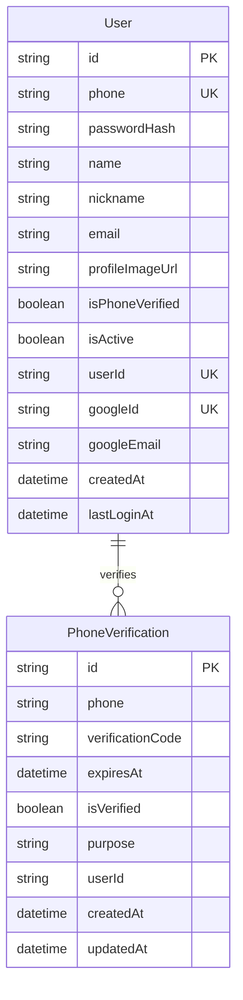
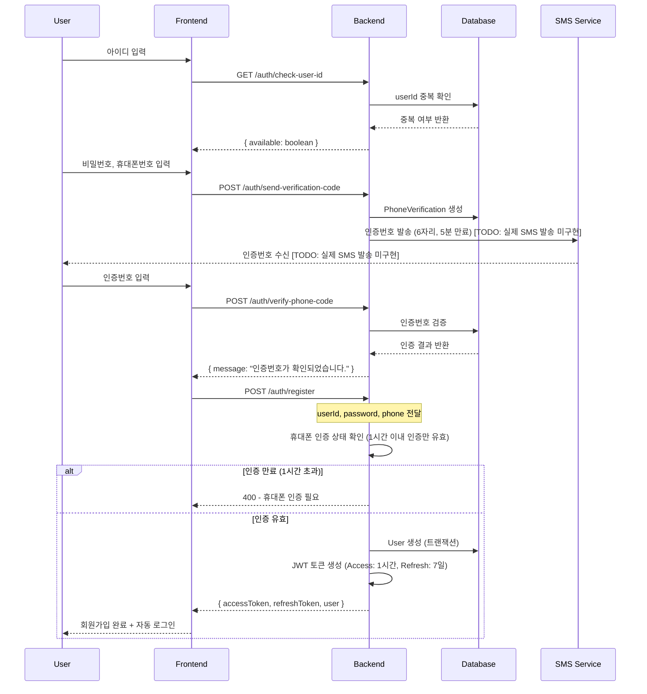
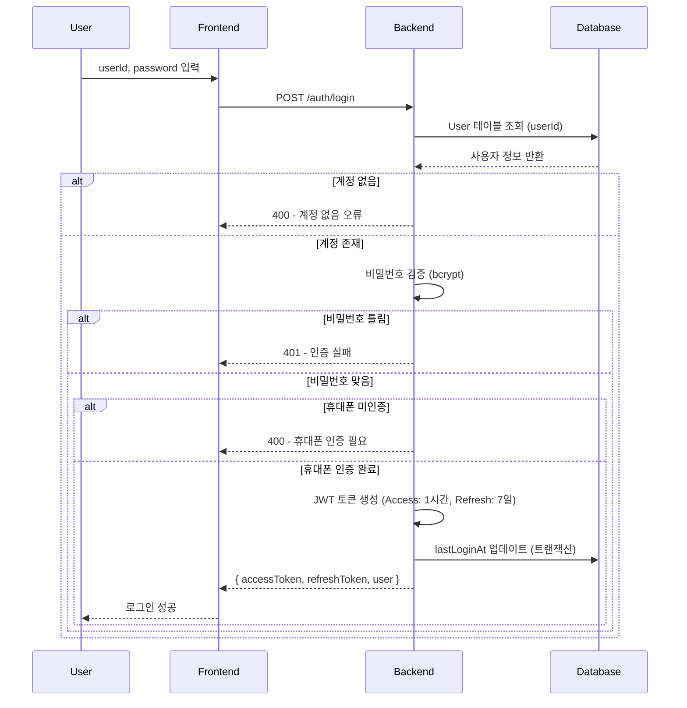
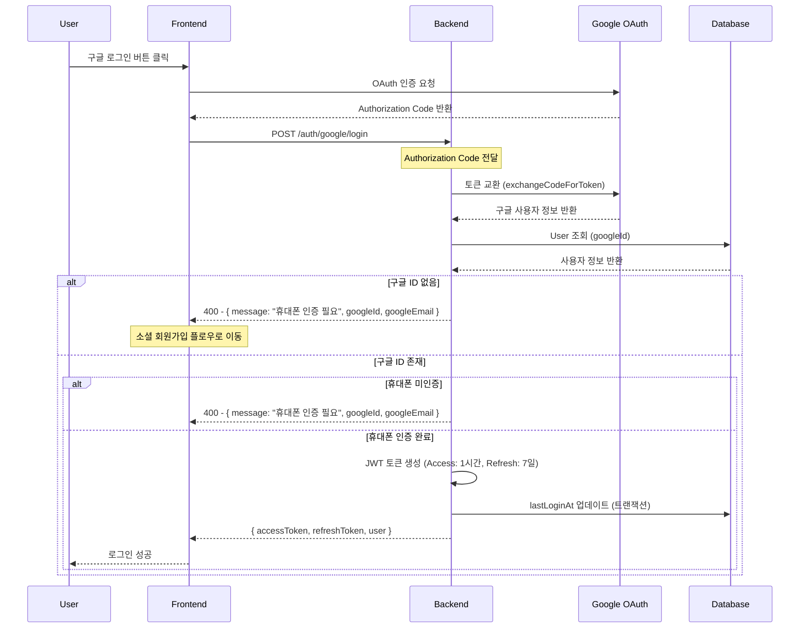
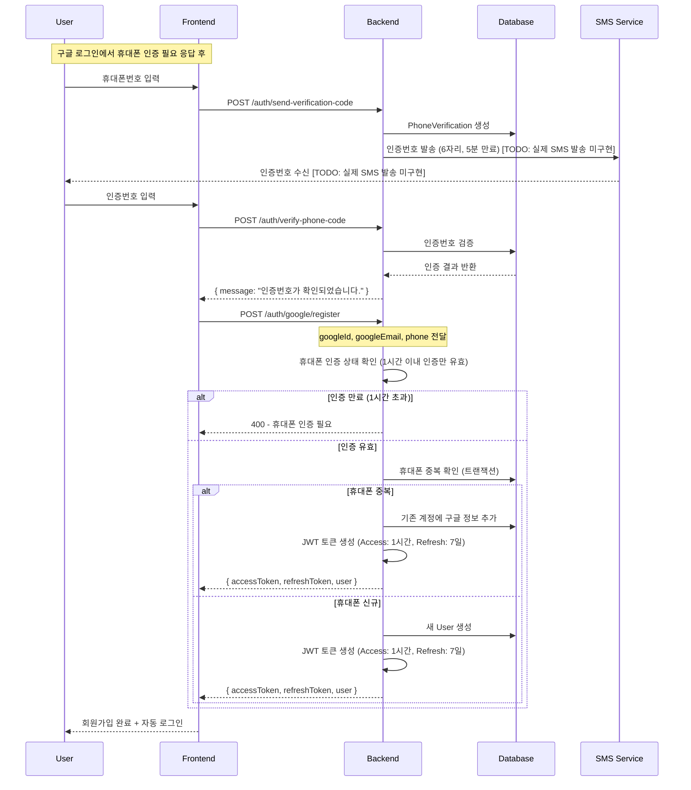
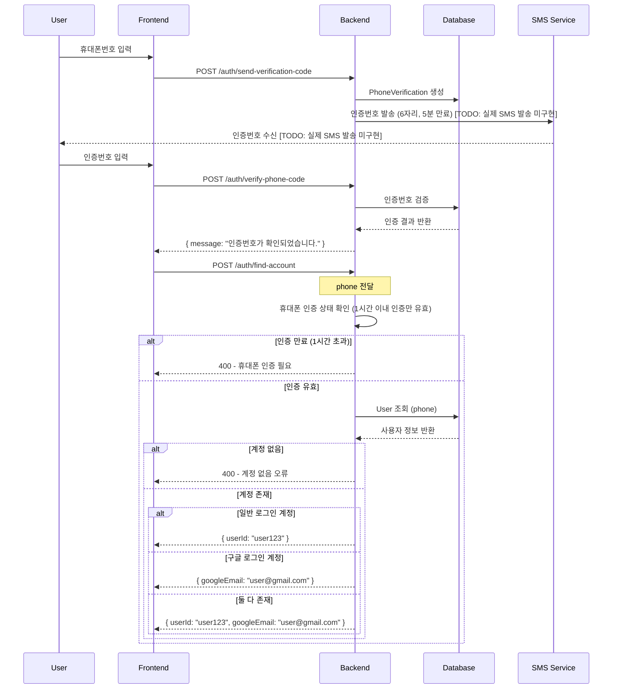
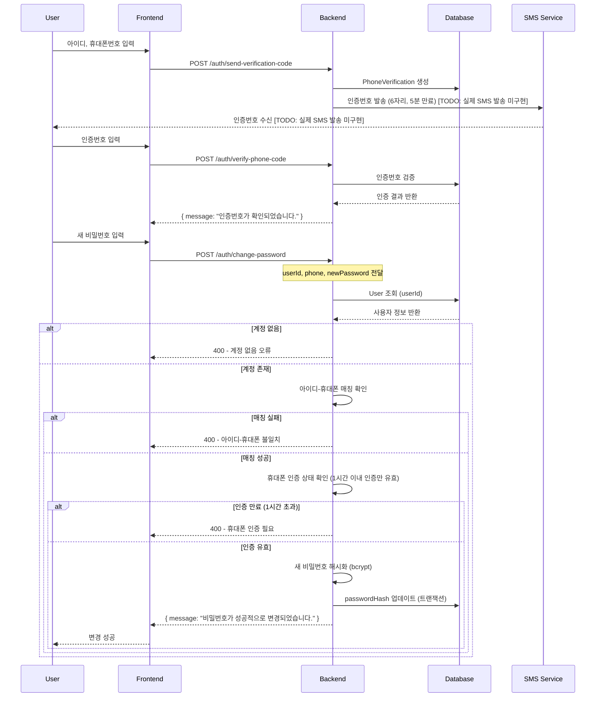
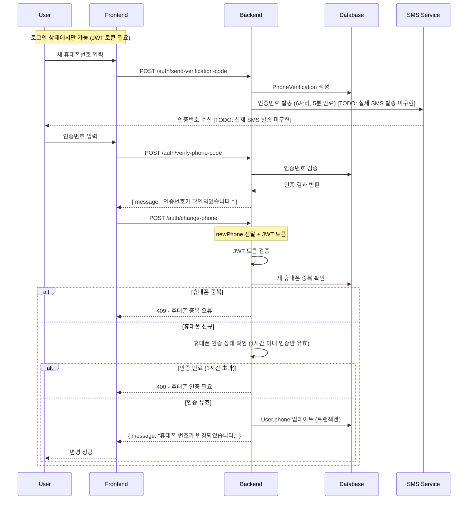
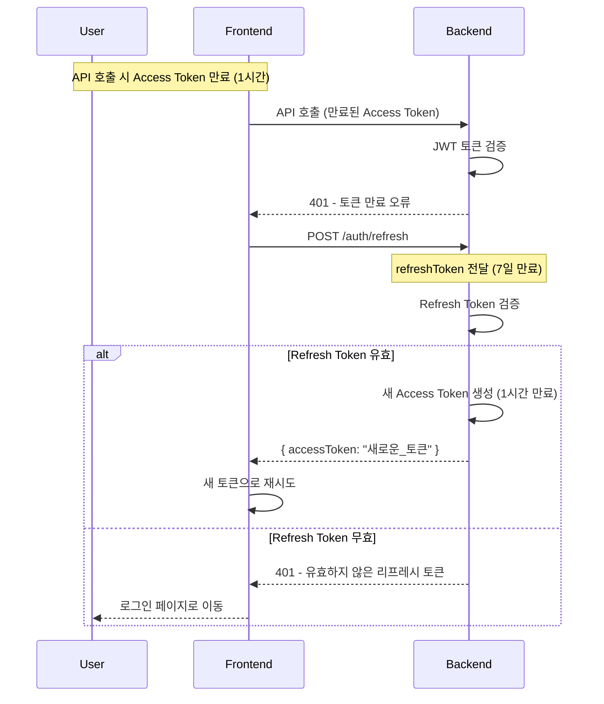

# 통합 로그인 및 회원가입 ERD (Entity Relationship Diagram)

## 개요

Sweet Order 플랫폼의 통합 로그인 및 회원가입 시스템을 위한 ERD입니다. 다양한 로그인 방식(일반 로그인, 소셜 로그인, 휴대폰 인증)을 지원하는 통합 인증 시스템의 핵심 엔티티들과 관계를 정의합니다.

## 통합 인증 시스템 ERD 다이어그램

## 인증 시스템 엔티티 상세 설명

### 1. User (사용자 통합 정보)

**목적**: 모든 사용자 정보를 통합 관리하는 핵심 테이블

**주요 필드**:

- `id`: 기본키 (CUID)
- `phone`: 휴대폰 번호 (유니크, 통합 정보 탐색용, 10-11자리)
- `passwordHash`: 암호화된 비밀번호 (일반 로그인용)
- `name`: 사용자 실명
- `nickname`: 닉네임
- `email`: 이메일
- `profileImageUrl`: 프로필 이미지 URL
- `isPhoneVerified`: 휴대폰 인증 완료 여부
- `isActive`: 계정 활성화 상태
- `userId`: 사용자 ID (일반 회원가입용, 유니크)
- `googleId`: 구글 사용자 ID (구글 로그인용, 유니크)
- `googleEmail`: 구글 이메일
- `createdAt`: 계정 생성일시
- `lastLoginAt`: 마지막 로그인 시간

**보안 특징**:

- `phone` 유니크 제약으로 휴대폰 중복 가입 방지
- `userId` 유니크 제약으로 일반 로그인 ID 중복 방지
- `googleId` 유니크 제약으로 구글 계정 중복 방지
- `passwordHash`로 평문 비밀번호 저장 방지
- 통합 테이블로 계정 연결 로직 단순화

### 2. PhoneVerification (휴대폰 인증)

**목적**: 휴대폰 본인인증 시스템 관리

**주요 필드**:

- `id`: 기본키 (CUID)
- `phone`: 인증 대상 휴대폰 번호 (10-11자리)
- `verificationCode`: 인증번호 (6자리)
- `expiresAt`: 인증번호 만료시간
- `isVerified`: 인증 완료 여부
- `purpose`: 인증 목적 (registration, password_recovery, id_find)
- `userId`: 연관된 사용자 ID (비밀번호 찾기, 아이디 찾기 시)
- `createdAt`: 인증 요청일시
- `updatedAt`: 인증 수정일시

**보안 특징**:

- 인증번호 5분 만료
- `phone + verificationCode` 복합 유니크 제약
- 목적별 인증 관리 (회원가입, 비밀번호 찾기, 아이디 찾기)
- 시도 횟수 제한 (1분당 10회 + 24시간 내 10회)

## 통합 로그인 플로우

### 1. 일반 회원가입 플로우

### 2. 일반 로그인 플로우

### 3. 구글 로그인 플로우

### 4. 구글 회원가입 플로우

### 5. 계정 찾기 플로우

### 6. 비밀번호 변경 플로우

### 7. 휴대폰 번호 변경 플로우

### 8. 토큰 갱신 플로우

## 보안 시스템

### 1. 휴대폰 인증 보안

- **인증번호 만료**: 5분 후 자동 만료
- **인증 상태 유효기간**: 인증 완료 후 1시간 이내만 유효
  - 회원가입, 계정 찾기, 비밀번호 변경, 휴대폰 번호 변경 시 적용
  - 1시간 초과 시 재인증 필요
- **시도 횟수 제한**:
  - 1분당 10회 제한 (전역 Rate Limiting과 별도)
  - 24시간 내 최대 10회 제한 (인증 완료 시 카운트 초기화)
- **본인인증 API**: 신뢰할 수 있는 인증 서비스 연동 (현재 TODO 상태 - 실제 SMS 발송 미구현)
- **복합 유니크 제약**: phone + verification_code 조합으로 중복 방지
- **목적별 관리**: registration, password_recovery, id_find 구분
- **인증 완료 시 정리**: 미완료 인증 기록 자동 삭제로 카운트 초기화

### 2. 비밀번호 보안

- **해시 알고리즘**: bcrypt 사용
- **솔트**: 개별 사용자별 고유 솔트 (bcrypt 자동 생성)
- **정책 강제**:
  - 클라이언트: 실시간 유효성 검사
  - 서버: class-validator를 통한 DTO 검증
  - 8자 이상의 영문 대소문자, 숫자, 특수문자(@$!%\*?&) 포함 필수

### 3. JWT 토큰 보안

- **토큰 타입 구분**: ACCESS, REFRESH 토큰 구분
- **만료시간 관리**:
  - Access Token: 1시간
  - Refresh Token: 7일
- **수동 갱신**: Refresh Token을 통한 수동 갱신
- **Stateless**: 서버에 토큰 저장하지 않음
- **토큰 페이로드**: sub, phone, loginType, loginId, type 포함

### 4. Rate Limiting

- **전역 제한**: 1분당 100회 (모든 API)
- **휴대폰 인증 특별 제한**: 1분당 10회 (send-verification-code)
- **구현**: @nestjs/throttler 사용

### 5. 입력 검증

- **프론트엔드**: 실시간 유효성 검사
- **백엔드**:
  - class-validator를 통한 DTO 검증
  - 커스텀 데코레이터 사용 (@IsValidUserId, @IsValidPassword, @IsValidKoreanPhone, @IsValidVerificationCode)
- **SQL 인젝션 방지**: Prisma ORM 사용
- **휴대폰 형식**: 010-019로 시작하는 10-11자리 검증 (하이픈, 공백 자동 제거)
- **아이디 형식**: 4-20자의 영문, 숫자, 언더스코어만 사용 가능

### 6. 계정 연결 보안

- **휴대폰 기반 통합**: 동일 휴대폰으로 가입된 계정 자동 연결
- **스마트 계정 관리**: 4가지 케이스 자동 처리
  - 일반 로그인 + 구글 로그인 모두 가능
  - 일반 로그인만 가능
  - 구글 로그인만 가능
  - 신규 계정 생성
- **중복 방지**: phone, userId, googleId 유니크 제약
- **트랜잭션 처리**: 모든 계정 생성/수정 작업을 트랜잭션으로 처리

### 7. 에러 처리

- **구체적인 에러 메시지**: 각 상황별 명확한 에러 메시지 제공
- **HTTP 상태 코드**: 적절한 상태 코드 사용 (400, 401, 409, 429)
- **Global Exception Filter**: 일관된 에러 응답 형식
- **Success Response Interceptor**: 성공 응답 자동 래핑

## 보안 모니터링

### 1. 로그인 시도 모니터링

- **실패한 로그인 시도 추적**: 401 Unauthorized 응답 로깅
- **의심스러운 IP 주소 모니터링**: Rate Limiting을 통한 자동 차단
- **비정상적인 로그인 패턴 감지**: 1분당 100회 제한으로 브루트 포스 공격 방지

### 2. 휴대폰 인증 모니터링

- **인증번호 발송 횟수 추적**: 1분당 10회 + 24시간 내 10회 제한
- **인증 실패 횟수 모니터링**: 5분 만료 + 인증 완료 시 카운트 초기화
- **스팸 방지 시스템**: Rate Limiting + 인증 완료 시 미완료 기록 삭제

### 3. 토큰 관리 모니터링

- **토큰 갱신 요청 추적**: Refresh Token 사용 패턴 모니터링
- **만료된 토큰 사용 시도 모니터링**: 401 응답 로깅
- **토큰 만료시간**: Access Token 1시간, Refresh Token 7일

### 4. 데이터베이스 모니터링

- **트랜잭션 처리**: 모든 중요한 작업을 트랜잭션으로 처리
- **인덱스 최적화**: phone, userId, googleId 인덱스로 성능 최적화
- **유니크 제약**: 중복 데이터 방지

## 구현 상태 및 TODO

### 완료된 기능

- ✅ 모든 API 엔드포인트 구현
- ✅ JWT 토큰 기반 인증 시스템
- ✅ 휴대폰 인증 시스템 (인증번호 생성/검증, SMS 발송은 TODO)
- ✅ 구글 OAuth 로그인
- ✅ 통합 계정 관리 (일반 + 구글)
- ✅ Rate Limiting
- ✅ 입력 검증 및 에러 처리
- ✅ Swagger API 문서화

### TODO 항목

- 🔄 SMS 발송 서비스 연동 (현재 TODO 상태 - 실제 SMS 발송 미구현)
- 🔄 로그인 시도 모니터링 시스템
- 🔄 보안 이벤트 알림 시스템
- 🔄 사용자 활동 로그 시스템

## 기술 스택

### Backend

- **Framework**: NestJS
- **Database**: PostgreSQL + Prisma ORM
- **Authentication**: JWT (jsonwebtoken)
- **Password Hashing**: bcrypt
- **Validation**: class-validator
- **Rate Limiting**: @nestjs/throttler
- **API Documentation**: Swagger/OpenAPI

### Security Features

- **CORS**: Cross-Origin Resource Sharing 설정
- **Helmet**: 보안 헤더 설정
- **Global Exception Filter**: 일관된 에러 처리
- **Success Response Interceptor**: 성공 응답 표준화

이 ERD는 Sweet Order 플랫폼의 통합 로그인 및 회원가입 시스템을 위한 완전한 데이터베이스 설계를 제공하며, 실제 구현된 코드를 정확히 반영하여 보안성과 확장성을 고려하여 설계되었습니다. 모든 API 엔드포인트가 구현되어 있으며, 상세한 요청/응답 구조와 에러 케이스가 문서화되어 있습니다.
