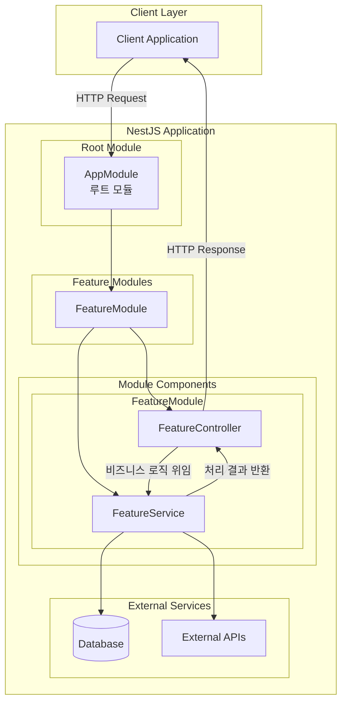
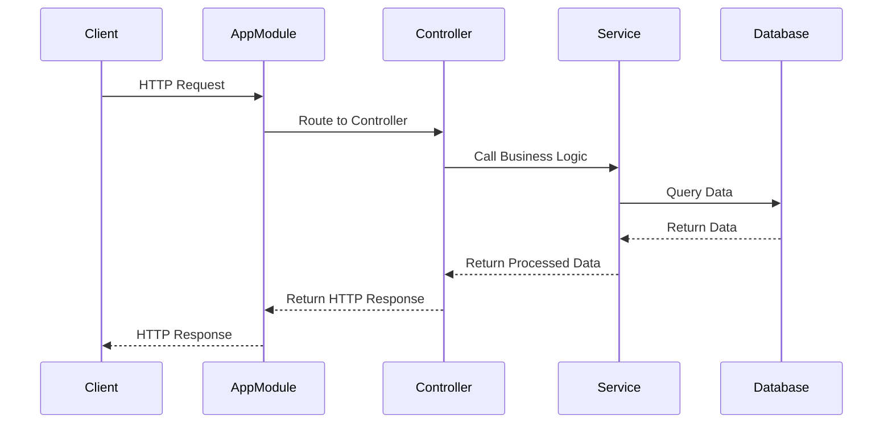

# NestJS 프레임워크 가이드

## 개요

NestJS는 Node.js를 위한 확장 가능한 서버 사이드 애플리케이션 프레임워크입니다. TypeScript를 완전히 지원하며, 모듈화된 아키텍처를 통해 효율적인 애플리케이션 개발을 가능하게 합니다.

## NestJS 구조도



## 요청 처리 흐름



## 핵심 구성요소

### 1. 모듈 (Module)

애플리케이션의 기본 구성 단위로, 관련된 컨트롤러, 서비스, 프로바이더들을 그룹화합니다.

```typescript
@Module({
  controllers: [FeatureController],
  providers: [FeatureService],
  exports: [FeatureService],
  imports: [ConfigModule],
})
export class FeatureModule {}
```

### 2. 컨트롤러 (Controller)

HTTP 요청을 받아 처리하고 응답을 반환하는 역할을 담당합니다.

```typescript
@Controller("auth")
@UseGuards(JwtAuthGuard)
export class AuthController {
  constructor(private readonly authService: AuthService) {}

  @Post("login")
  @Public()
  @HttpCode(HttpStatus.OK)
  async login(@Body() loginDto: LoginRequestDto) {
    return this.authService.login(loginDto);
  }
}
```

### 3. 서비스 (Service)

비즈니스 로직을 담당하는 핵심 구성요소입니다.

```typescript
@Injectable()
export class AuthService {
  constructor(
    private readonly userService: UserService,
    private readonly phoneService: PhoneService,
  ) {}

  async login(loginDto: LoginRequestDto) {
    return this.userService.login(loginDto);
  }
}
```

### 상세 처리 과정

1. **요청 수신**: 클라이언트가 HTTP 요청을 서버로 전송
2. **전역 접두사 적용**: `/v1` 접두사가 자동으로 추가됨
3. **CORS 및 보안 헤더**: helmet, CORS 설정 적용
4. **Rate Limiting**: ThrottlerGuard를 통한 요청 제한 검사
5. **라우팅**: NestJS가 요청 URL을 분석하여 적절한 컨트롤러와 메서드 찾기
6. **JWT 인증**: JwtAuthGuard를 통한 인증 검사 (Public 데코레이터가 없는 경우)
7. **유효성 검사**: ValidationPipe를 통한 DTO 검증
8. **컨트롤러 실행**: 해당 컨트롤러 메서드 호출
9. **서비스 호출**: 컨트롤러에서 비즈니스 로직을 담당하는 서비스 호출
10. **비즈니스 로직 처리**: 서비스에서 실제 데이터 처리 및 계산
11. **응답 인터셉터**: SuccessResponseInterceptor가 응답을 통일된 형태로 래핑
12. **HTTP 응답**: 클라이언트에게 JSON 응답 반환

## 의존성 주입 (Dependency Injection)

NestJS는 강력한 의존성 주입 시스템을 제공합니다.

### 생성자 주입 예시

```typescript
@Injectable()
export class AuthService {
  constructor(
    private readonly userService: UserService,
    private readonly phoneService: PhoneService,
    private readonly googleService: GoogleService,
    private readonly jwtUtil: JwtUtil,
  ) {}
}
```

## 애플리케이션 구조

```
src/
├── main.ts                 # 애플리케이션 진입점
├── app.module.ts          # 루트 모듈 (모든 모듈을 통합)
├── modules/               # 기능별 모듈들
│   └── auth/             # 인증 모듈
│       ├── auth.controller.ts
│       ├── auth.module.ts
│       ├── auth.service.ts
│       ├── constants/    # 상수 정의
│       ├── dto/         # 요청/응답 DTO
│       ├── guards/      # 인증 가드
│       ├── services/    # 세부 서비스들
│       ├── strategies/  # Passport 전략
│       └── utils/       # 유틸리티 함수들
├── common/               # 공통 유틸리티
│   ├── constants/       # 앱 상수
│   ├── decorators/      # 커스텀 데코레이터
│   ├── interceptors/    # 응답 인터셉터
│   └── types/          # 공통 타입 정의
└── database/            # 데이터베이스 모듈
    ├── database.module.ts
    └── prisma.service.ts
```

## 모범 사례

### 1. 모듈 설계 원칙

- **단일 책임 원칙**: 각 모듈은 하나의 도메인만 담당
- **응집도**: 관련된 기능들을 하나의 모듈로 그룹화
- **결합도**: 모듈 간 의존성을 최소화

### 2. 컨트롤러 설계 원칙

- **얇은 컨트롤러**: 비즈니스 로직은 서비스에 위임
- **명확한 라우팅**: RESTful API 설계 원칙 준수
- **적절한 HTTP 상태 코드**: 의미 있는 상태 코드 사용

### 3. 서비스 설계 원칙

- **비즈니스 로직 집중**: 핵심 비즈니스 로직 구현
- **재사용성**: 여러 컨트롤러에서 사용 가능하도록 설계
- **테스트 가능성**: 단위 테스트가 용이하도록 설계

## 핵심 개념 요약

- **모듈**: 애플리케이션의 기본 구성 단위, 관련 기능들을 그룹화
- **컨트롤러**: HTTP 요청의 진입점, 라우팅과 응답 생성 담당
- **서비스**: 비즈니스 로직의 핵심, 데이터 처리와 외부 연동 담당
- **의존성 주입**: 느슨한 결합을 통한 코드 재사용성과 테스트 용이성 향상

## 참고 자료

- [NestJS 공식 문서](https://docs.nestjs.com/)
- [TypeScript 공식 문서](https://www.typescriptlang.org/docs/)
- [Node.js 공식 문서](https://nodejs.org/docs/)
