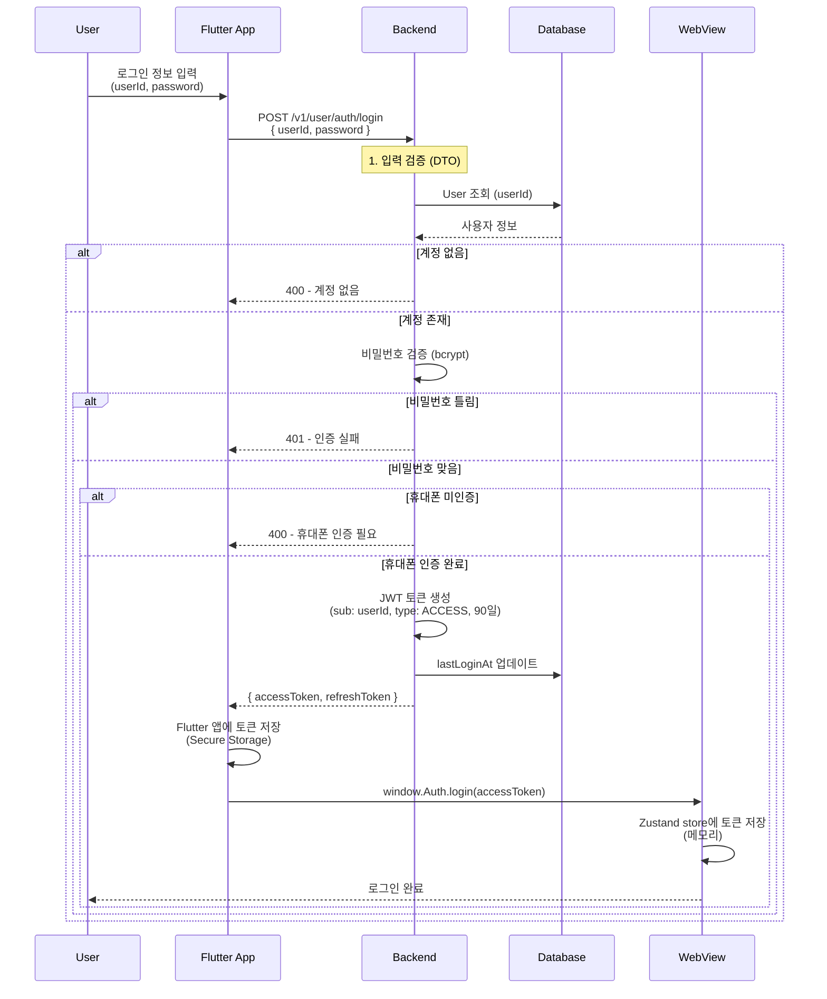
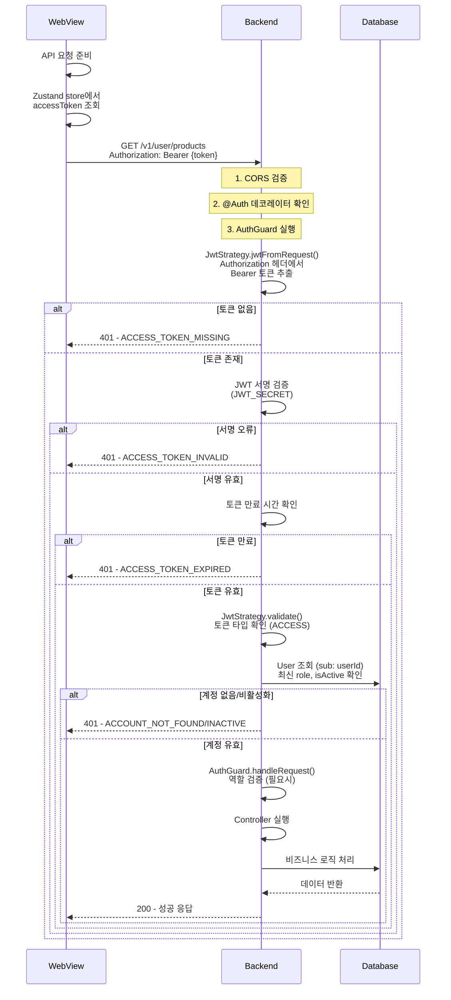
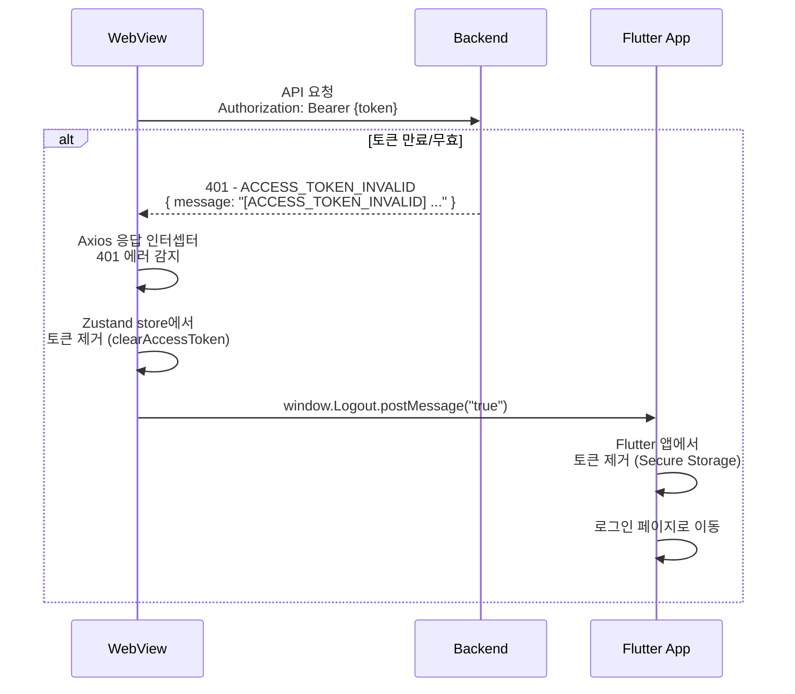
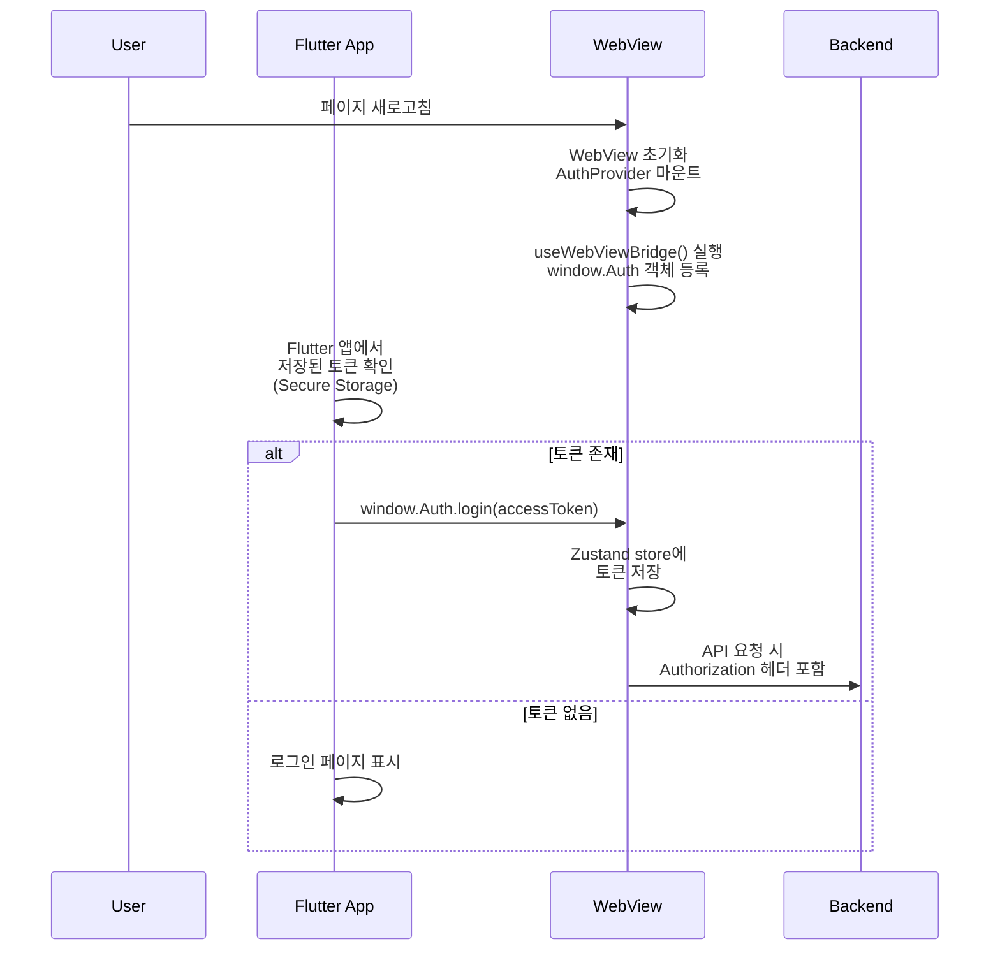
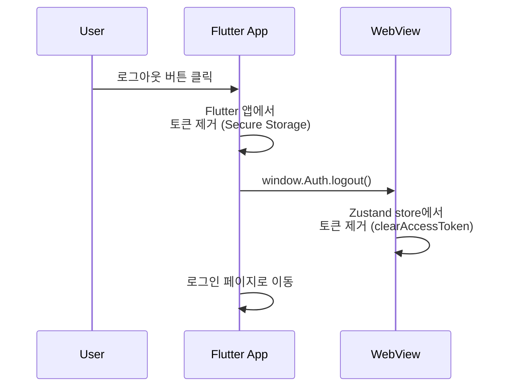

# 사용자 - 웹뷰 인증 가이드

## 📋 개요

Sweet Order 플랫폼의 사용자 인증 시스템은 Flutter WebView 환경에서 동작하도록 설계되었습니다. Flutter 앱과 웹뷰 간의 토큰 동기화를 통해 통합된 인증 경험을 제공합니다.

## 🎯 주요 특징

- **Flutter WebView 통합**: Flutter 앱과 웹뷰 간 토큰 동기화
- **헤더 기반 토큰 전송**: Authorization 헤더에 Bearer 토큰 포함
- **메모리 기반 토큰 저장**: Zustand store에 토큰 저장 (localStorage 미사용)
- **자동 로그아웃 처리**: 401 에러 시 Flutter 앱에 로그아웃 메시지 전송

## 🔄 전체 인증 플로우

### 1. 로그인 플로우 (Flutter 앱 → 백엔드 → WebView)

### 2. API 요청 플로우 (WebView → 백엔드)

### 3. 401 에러 처리 플로우 (WebView → Flutter 앱)

### 4. 새로고침 시 로그인 유지 플로우

### 5. 로그아웃 플로우

