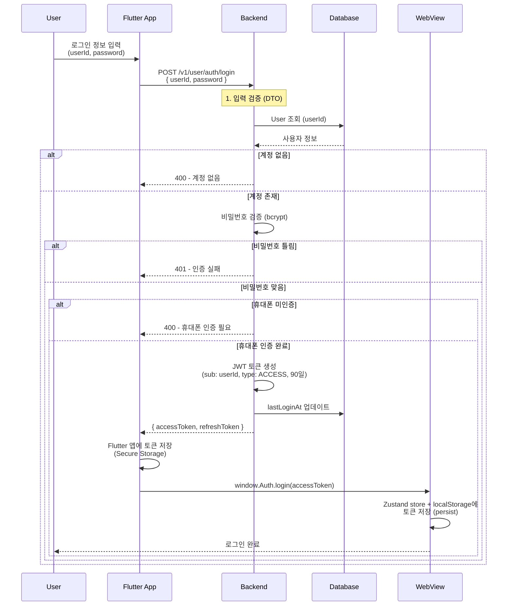
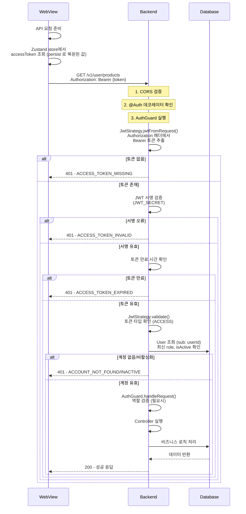
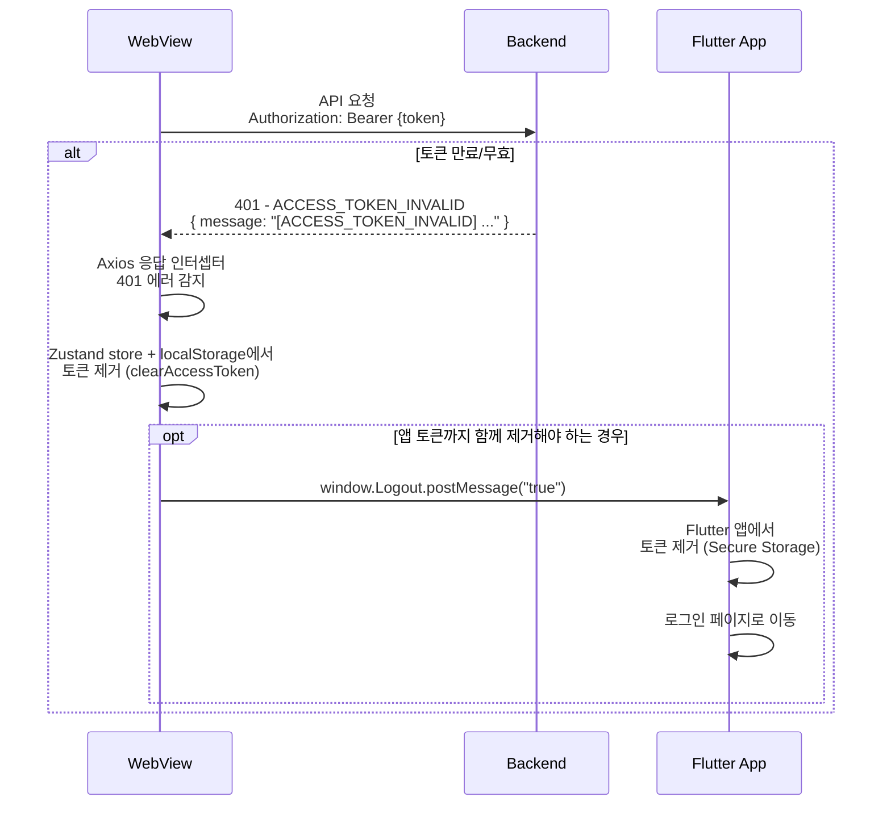
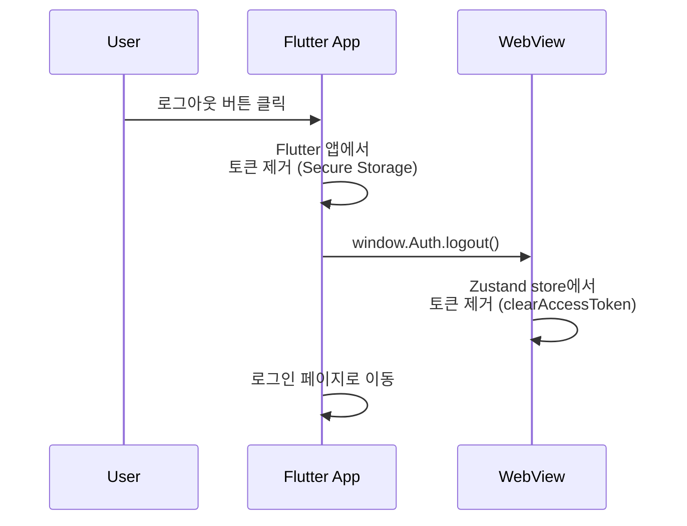

# 사용자 - 웹뷰 인증 가이드

## 📋 개요

Sweet Order 플랫폼의 사용자 인증 시스템은 Flutter WebView 환경에서 동작하도록 설계되었습니다. Flutter 앱과 웹뷰 간의 토큰 동기화를 통해 통합된 인증 경험을 제공합니다.

## 🎯 주요 특징

- **Flutter WebView 통합**: Flutter 앱과 웹뷰 간 토큰 동기화
- **헤더 기반 토큰 전송**: Authorization 헤더에 Bearer 토큰 포함
- **스토리지 기반 토큰 저장**: Zustand store + `persist` 로 토큰 저장 (브라우저 `localStorage` 사용)
- **자동 로그아웃 처리**: 401 에러 시 웹뷰에서 토큰만 제거 (`clearAccessToken`), Flutter 로그아웃 브릿지 호출은 선택 사항

## 🔄 전체 인증 플로우

### 1. 로그인 플로우 (Flutter 앱 → 백엔드 → WebView)

```mermaid
sequenceDiagram
    participant U as User
    participant F as Flutter App
    participant B as Backend
    participant DB as Database
    participant W as WebView

    U->>F: 로그인 정보 입력<br/>(userId, password)
    F->>B: POST /v1/user/auth/login<br/>{ userId, password }

    Note over B: 1. 입력 검증 (DTO)
    B->>DB: User 조회 (userId)
    DB-->>B: 사용자 정보

    alt 계정 없음
        B-->>F: 400 - 계정 없음
    else 계정 존재
        B->>B: 비밀번호 검증 (bcrypt)
        alt 비밀번호 틀림
            B-->>F: 401 - 인증 실패
        else 비밀번호 맞음
            alt 휴대폰 미인증
                B-->>F: 400 - 휴대폰 인증 필요
            else 휴대폰 인증 완료
                B->>B: JWT 토큰 생성<br/>(sub: userId, type: ACCESS, 90일)
                B->>DB: lastLoginAt 업데이트
                B-->>F: { accessToken, refreshToken }

                F->>F: Flutter 앱에 토큰 저장<br/>(Secure Storage)
                F->>W: window.Auth.login(accessToken)
                W->>W: Zustand store + localStorage에<br/>토큰 저장 (persist)
                W-->>U: 로그인 완료
            end
        end
    end
```

### 2. API 요청 플로우 (WebView → 백엔드)

```mermaid
sequenceDiagram
    participant W as WebView
    participant B as Backend
    participant DB as Database

    W->>W: API 요청 준비
    W->>W: Zustand store에서<br/>accessToken 조회 (persist 로 복원된 값)
    W->>B: GET /v1/user/products<br/>Authorization: Bearer {token}

    Note over B: 1. CORS 검증
    Note over B: 2. @Auth 데코레이터 확인
    Note over B: 3. AuthGuard 실행

    B->>B: JwtStrategy.jwtFromRequest()<br/>Authorization 헤더에서<br/>Bearer 토큰 추출

    alt 토큰 없음
        B-->>W: 401 - ACCESS_TOKEN_MISSING
    else 토큰 존재
        B->>B: JWT 서명 검증<br/>(JWT_SECRET)
        alt 서명 오류
            B-->>W: 401 - ACCESS_TOKEN_INVALID
        else 서명 유효
            B->>B: 토큰 만료 시간 확인
            alt 토큰 만료
                B-->>W: 401 - ACCESS_TOKEN_EXPIRED
            else 토큰 유효
                B->>B: JwtStrategy.validate()<br/>토큰 타입 확인 (ACCESS)
                B->>DB: User 조회 (sub: userId)<br/>최신 role, isActive 확인

                alt 계정 없음/비활성화
                    B-->>W: 401 - ACCOUNT_NOT_FOUND/INACTIVE
                else 계정 유효
                    B->>B: AuthGuard.handleRequest()<br/>역할 검증 (필요시)
                    B->>B: Controller 실행
                    B->>DB: 비즈니스 로직 처리
                    DB-->>B: 데이터 반환
                    B-->>W: 200 - 성공 응답
                end
            end
        end
    end
```

### 3. 401 에러 처리 플로우 (WebView → Flutter 앱)

```mermaid
sequenceDiagram
    participant W as WebView
    participant B as Backend
    participant F as Flutter App

    W->>B: API 요청<br/>Authorization: Bearer {token}

    alt 토큰 만료/무효
        B-->>W: 401 - ACCESS_TOKEN_INVALID<br/>{ message: "[ACCESS_TOKEN_INVALID] ..." }

        W->>W: Axios 응답 인터셉터<br/>401 에러 감지
        W->>W: Zustand store + localStorage에서<br/>토큰 제거 (clearAccessToken)

        opt 앱 토큰까지 함께 제거해야 하는 경우
            W->>F: window.Logout.postMessage("true")
            F->>F: Flutter 앱에서<br/>토큰 제거 (Secure Storage)
            F->>F: 로그인 페이지로 이동
        end
    end
```

### 4. 새로고침 시 로그인 유지 플로우

```mermaid
sequenceDiagram
    participant U as User
    participant F as Flutter App
    participant W as WebView
    participant B as Backend

    U->>W: 페이지 새로고침

    W->>W: WebView 초기화<br/>AuthProvider 마운트
    W->>W: useWebViewBridge() 실행<br/>window.Auth 객체 등록
    W->>W: Zustand persist 하이드레이션<br/>(localStorage에서 토큰 복원)

    alt localStorage에 토큰 존재
        W->>B: API 요청 시<br/>Authorization 헤더 포함
    else 토큰 없음
        opt Flutter 앱에 저장된 토큰 존재
            F->>F: Flutter 앱에서<br/>저장된 토큰 확인<br/>(Secure Storage)
            F->>W: window.Auth.login(accessToken)
            W->>W: Zustand store + localStorage에<br/>토큰 저장
        else 저장된 토큰 없음
            F->>F: 로그인 페이지 표시
        end
    end
```

### 5. 로그아웃 플로우

```mermaid
sequenceDiagram
    participant U as User
    participant F as Flutter App
    participant W as WebView

    U->>F: 로그아웃 버튼 클릭
    F->>F: Flutter 앱에서<br/>토큰 제거 (Secure Storage)
    F->>W: window.Auth.logout()
    W->>W: Zustand store에서<br/>토큰 제거 (clearAccessToken)
    F->>F: 로그인 페이지로 이동
```
