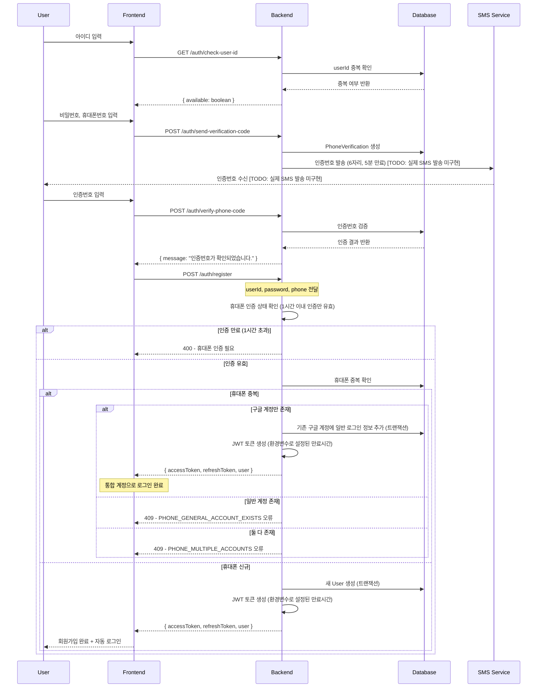
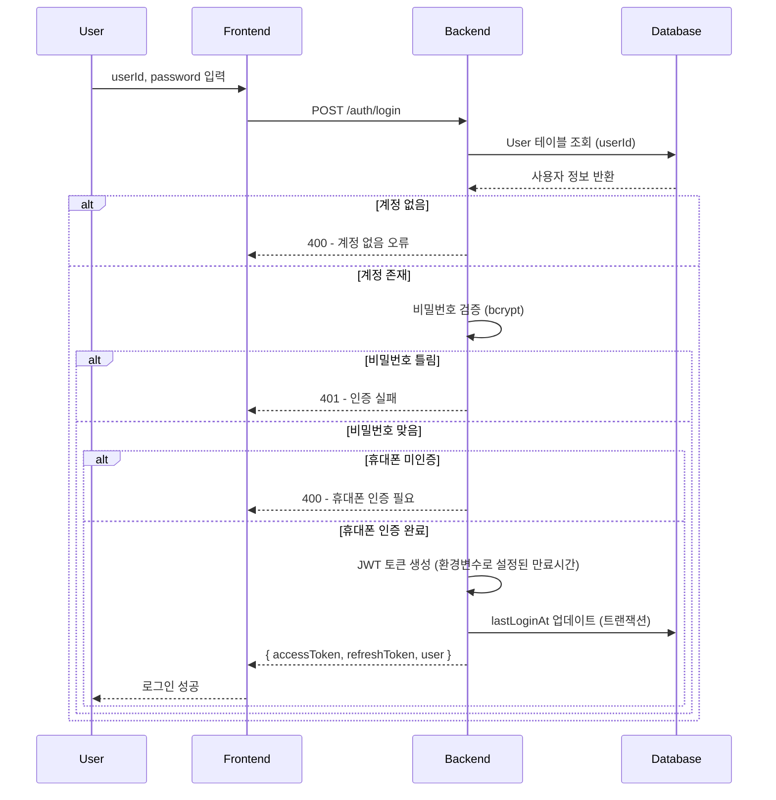
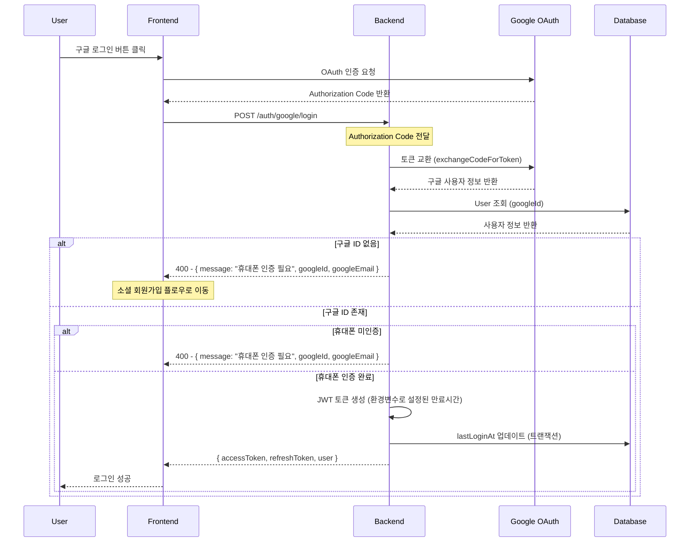
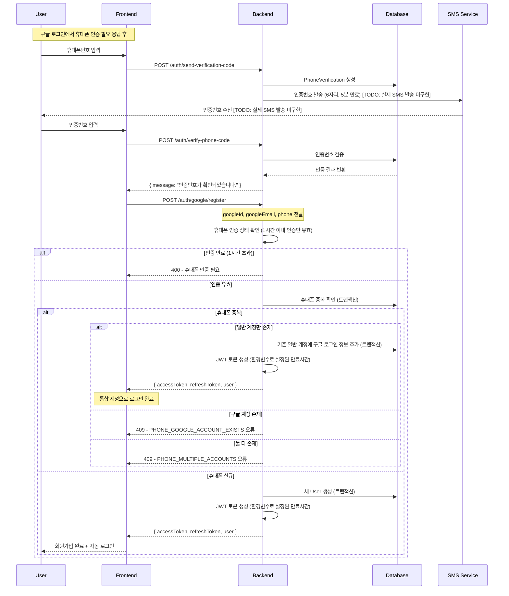
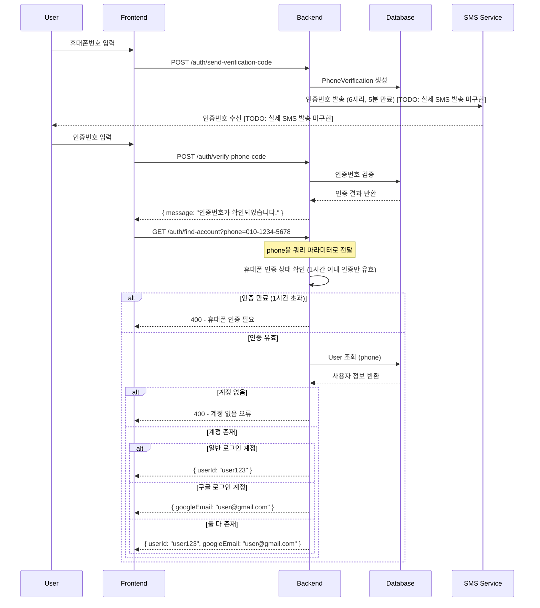
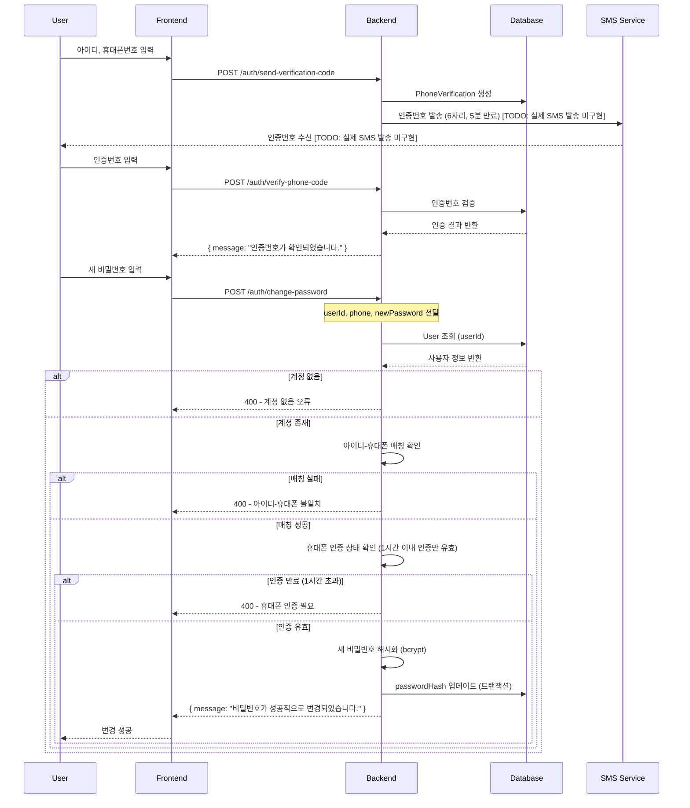
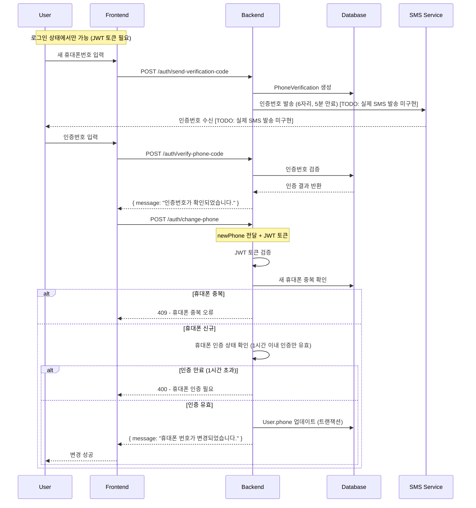
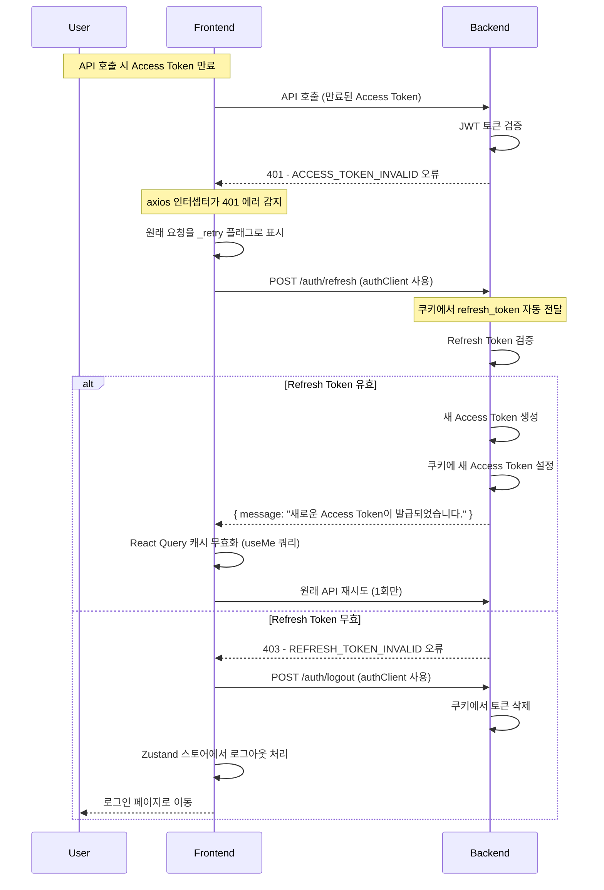
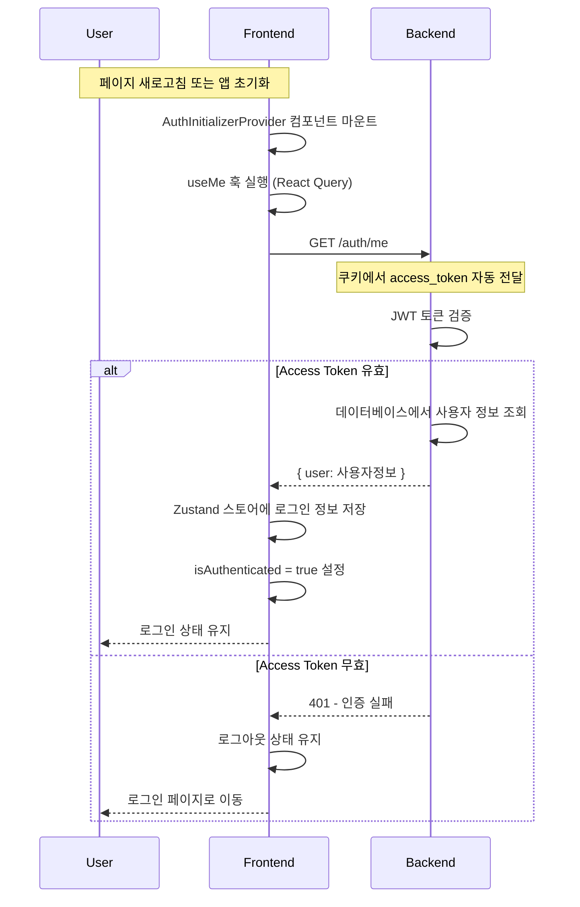

# 통합 인증 - 가이드

## 개요

Sweet Order 플랫폼의 통합 인증 시스템 가이드입니다. 이 문서는 다양한 로그인 방식(일반 로그인, 구글 OAuth, 휴대폰 인증)을 지원하는 통합 인증 시스템의 전체 아키텍처, 구현 방식, 보안 정책, 그리고 프론트엔드와 백엔드 간의 상호작용을 상세히 설명합니다.

### 주요 특징

- **통합 인증 시스템**: 일반 로그인 + 구글 OAuth + 휴대폰 인증을 하나의 시스템으로 통합
- **쿠키 기반 토큰 관리**: 서브도메인 통합 로그인을 위한 JWT 토큰 쿠키 전송
- **자동 토큰 갱신**: 프론트엔드 axios 인터셉터를 통한 자동 토큰 갱신 및 로그인 유지
- **새로고침 로그인 유지**: AuthInitializerProvider를 통한 자동 사용자 정보 복원
- **계정 연결**: 동일 휴대폰으로 가입된 일반/구글 계정 자동 연결
- **보안 강화**: Rate Limiting, 입력 검증, 에러 처리, 트랜잭션 처리 등 종합적인 보안 시스템

## 통합 로그인 플로우

### 1. 일반 회원가입 플로우 (계정 연결 포함)



### 2. 일반 로그인 플로우



### 3. 구글 로그인 플로우



### 4. 구글 회원가입 플로우 (계정 연결 포함)



### 5. 계정 찾기 플로우



### 6. 비밀번호 변경 플로우



### 7. 휴대폰 번호 변경 플로우



### 8. 토큰 갱신 플로우 (프론트엔드 자동 처리)



### 9. 새로고침 시 로그인 유지 플로우



## 프론트엔드 인증 처리 상세

### 1. 액세스/리프레시 토큰 만료 및 발급 처리

#### HTTP 상태 코드 구분

- **401**: 인증 실패 (토큰 없음/액세스 토큰 검증 실패/액세스 토큰 만료/role 권한없음/기타 권한 없음)
- **403**: 권한 없음 (리프레시토큰에 대한것만 → 리프레시 토큰 검증 실패/리프레시 토큰 만료)

#### axios 인터셉터 구현

```typescript
// apps/web-user/src/common/config/axios.config.ts
apiClient.interceptors.response.use(
  (response: AxiosResponse) => {
    return response;
  },
  async (error: AxiosError<any>) => {
    const status = error.response?.status;
    const message = error.response?.data?.data?.message;
    const originalRequest = error.config as AxiosRequestConfig & {
      _retry?: boolean;
    };

    // 401 → 한 번만 리프레시 시도 후 원래 요청 1회 재시도
    if (status === 401 && message?.includes("ACCESS_TOKEN_INVALID")) {
      if (originalRequest._retry) {
        // 이미 한 번 재시도한 요청이면 중단
        return Promise.reject(error);
      }
      originalRequest._retry = true;

      try {
        // 리프레시: authClient로 호출(인터셉터 호출되지 않음)
        await authApi.refresh(authClient);

        // React Query 캐시 무효화 (자동으로 재요청됨)
        if (queryClient) {
          queryClient.invalidateQueries({ queryKey: authQueryKeys.me });
        }

        // 리프레시 성공 → 원래 요청 1회만 재시도
        return apiClient(originalRequest);
      } catch (error) {
        // 리프레시 실패 → 즉시 로그아웃 처리
        await authApi.logout(authClient);
        useAuthStore.getState().logout();
        return Promise.reject(error);
      }
    }

    return Promise.reject(error);
  },
);
```

#### 토큰 갱신 플로우

1. **API 호출 시 Access Token 만료**
2. **401 에러 발생** → axios 인터셉터가 감지
3. **원래 요청을 \_retry 플래그로 표시**
4. **POST /auth/refresh 호출** (authClient 사용, 쿠키에서 refresh_token 자동 전달)
5. **Refresh Token 검증**
   - **유효한 경우**: 새 Access Token 생성 → 쿠키에 설정 → React Query 캐시 무효화 → 원래 API 재시도 (1회만)
   - **무효한 경우**: 403 에러 → POST /auth/logout 호출 → 쿠키에서 토큰 삭제 → Zustand 스토어에서 로그아웃 처리 → 로그인 페이지로 이동

#### 무한 루프 방지

- `_retry` 플래그로 토큰 갱신 시도 횟수 제한 (1회만)
- `authClient`와 `apiClient` 분리로 인터셉터 무한 루프 방지
- `/auth/me` API 호출 시 캐시 무효화 제외로 중복 호출 방지

## 보안 시스템

### 1. 휴대폰 인증 보안

- **인증번호 만료**: 5분 후 자동 만료
- **인증 상태 유효기간**: 인증 완료 후 1시간 이내만 유효
  - 회원가입, 계정 찾기, 비밀번호 변경, 휴대폰 번호 변경 시 적용
  - 1시간 초과 시 재인증 필요
- **시도 횟수 제한**:
  - 1분당 10회 제한 (전역 Rate Limiting과 별도)
- **본인인증 API**: 신뢰할 수 있는 인증 서비스 연동 (현재 TODO 상태 - 실제 SMS 발송 미구현)
- **인증 완료 시 정리**: 미완료 인증 기록 자동 삭제로 카운트 초기화

### 2. 비밀번호 보안

- **해시 알고리즘**: bcrypt 사용

### 3. JWT 토큰 보안

- **토큰 전송 방식**: 서브도메인 통합 로그인을 위한 쿠키 방식 (자세한 내용은 [통합 플랫폼 인증(쿠키 기반) - 가이드](./통합 플랫폼 인증(쿠키 기반) - 가이드.md) 참고)
- **토큰 타입 구분**: ACCESS, REFRESH 토큰 구분

### 4. Rate Limiting

- **전역 제한**: 1분당 100회 (모든 API)
- **휴대폰 인증 특별 제한**: 1분당 10회 (send-verification-code)
- **구현**: @nestjs/throttler 사용

### 5. 입력 검증

- **휴대폰 형식**: 010-019로 시작하는 10-11자리 검증 (하이픈, 공백 자동 제거)
- **아이디 형식**: 4-20자의 영문, 숫자, 언더스코어만 사용 가능
- **비밀번호 형식**: 8자 이상의 영문 대소문자, 숫자, 특수문자(@$!%\*?&) 포함 필수
- **인증번호 형식**: 6자리 숫자 포함 필수

### 6. 계정 연결 보안

- **휴대폰 기반 통합**: 동일 휴대폰으로 가입된 계정(일반/소셜) 자동 연결

### 7. 에러 처리

- **HTTP 상태 코드**: 적절한 상태 코드 사용
  - **401**: 인증 실패 (토큰 없음/액세스 토큰 검증 실패/액세스 토큰 만료/role 권한없음/기타 권한 없음)
  - **403**: 권한 없음 (리프레시토큰에 대한것만 → 리프레시 토큰 검증 실패/리프레시 토큰 만료)
  - **400, 409, 429**: 기타 에러 상황
- **토큰 갱신 실패 처리**: refresh API 실패 시 자동 로그아웃 및 로그인 페이지 이동
- **무한 루프 방지**: \_retry 플래그로 토큰 갱신 시도 횟수 제한 (1회만)

## 보안 모니터링

### 1. 로그인 시도 모니터링

- **의심스러운 IP 주소 모니터링**: Rate Limiting을 통한 자동 차단

### 2. 데이터베이스 모니터링

- **트랜잭션 처리**: 모든 중요한 작업을 트랜잭션으로 처리

이 가이드는 Sweet Order 플랫폼의 통합 인증 시스템을 위한 완전한 구현 가이드를 제공하며, 실제 구현된 코드를 반영하여 보안성과 확장성을 고려하여 설계되었습니다. 모든 API 엔드포인트가 구현되어 있으며, 상세한 요청/응답 구조와 에러 케이스, 프론트엔드와 백엔드 간의 상호작용이 문서화되어 있습니다.
