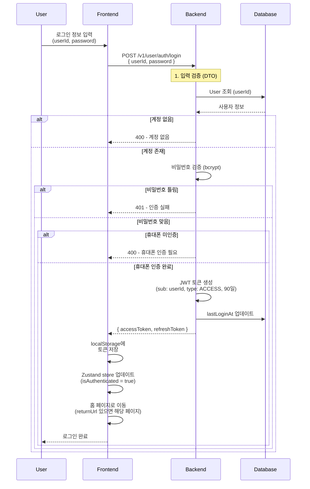
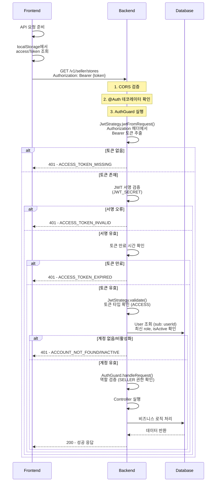
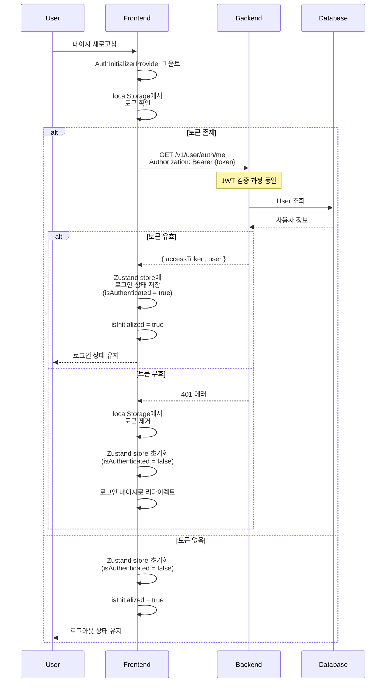
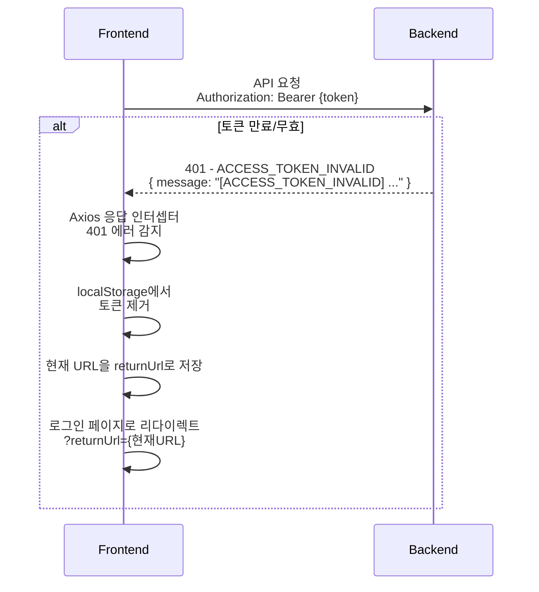
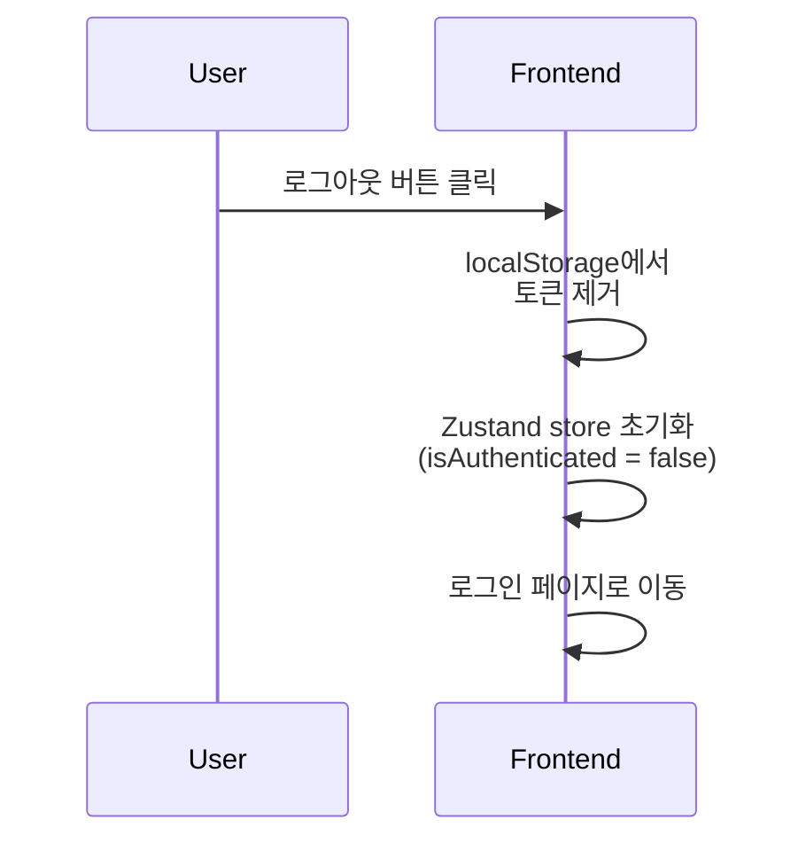

# 판매자 인증 가이드

## 📋 개요

Sweet Order 플랫폼의 판매자 인증 시스템은 웹 애플리케이션 환경에서 동작하도록 설계되었습니다. localStorage를 사용한 토큰 관리와 자동 로그인 상태 복원 기능을 제공합니다.

## 🎯 주요 특징

- **localStorage 기반 토큰 저장**: 브라우저 localStorage에 토큰 저장
- **헤더 기반 토큰 전송**: Authorization 헤더에 Bearer 토큰 포함
- **자동 로그인 상태 복원**: 새로고침 시 `/me` API로 자동 복원
- **자동 리다이렉트**: 401 에러 시 로그인 페이지로 자동 이동

## 🔄 전체 인증 플로우

### 1. 로그인 플로우 (웹 앱 → 백엔드)

### 2. API 요청 플로우 (웹 앱 → 백엔드)

### 3. 새로고침 시 로그인 유지 플로우

### 4. 401 에러 처리 플로우

### 5. 로그아웃 플로우

