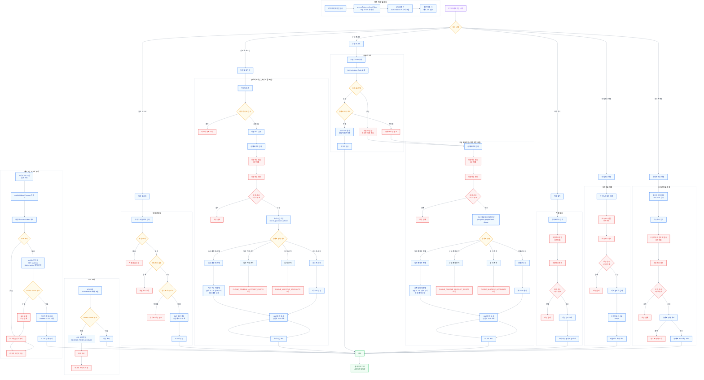

```mermaid
%%{init: {
  'theme': 'base',
  'themeVariables': {
    'primaryColor': '#f0f9ff',
    'primaryTextColor': '#1e293b',
    'primaryBorderColor': '#3b82f6',
    'lineColor': '#64748b',
    'tertiaryColor': '#f8fafc',
    'secondaryColor': '#e2e8f0',
    'clusterBkg': '#ffffff',
    'clusterBorder': '#cbd5e1',
    'nodeBkg': '#ffffff',
    'nodeBorder': '#3b82f6',
    'edgeLabelBackground': '#ffffff'
  }
}}%%
%% 깔끔한 블루 그라데이션 테마
flowchart TD
    Start[로그인/회원가입 시작] --> Choice{방식 선택}

    Choice -->|일반 로그인| NormalLogin[일반 로그인]
    Choice -->|일반 회원가입| NormalSignup[일반 회원가입]
    Choice -->|구글 로그인| GoogleLogin[구글 로그인]
    Choice -->|계정 찾기| FindAccount[계정 찾기]
    Choice -->|비밀번호 변경| ChangePassword[비밀번호 변경]
    Choice -->|휴대폰 변경| ChangePhone[휴대폰 번호 변경]

    subgraph NormalLoginFlow ["일반 로그인"]
        NL1[아이디/비밀번호 입력]
        NL2{계정 존재}
        NL3[계정 없음 오류]
        NL4{비밀번호 검증}
        NL5[비밀번호 오류]
        NL6{휴대폰 인증 완료}
        NL7[휴대폰 인증 필요]
        NL8[JWT 토큰 생성<br/>응답에 토큰 반환]
        NL9[로그인 성공]
    end

    subgraph NormalSignupFlow ["일반 회원가입 (계정 연결 포함)"]
        NS1[아이디 입력]
        NS1_1{아이디 중복 검사}
        NS1_2[아이디 중복 오류]
        NS2[비밀번호 입력]
        NS3[휴대폰번호 입력]
        NS4[인증번호 발송<br/>5분 만료]
        NS5[인증번호 확인]
        NS6{인증 성공<br/>1시간 유효}
        NS7[인증 실패]
        NS8[회원가입 신청<br/>userId, password, phone]
        NS9{휴대폰 중복 확인}
        NS10[구글 계정만 존재]
        NS11[기존 구글 계정에<br/>일반 로그인 정보 추가<br/>통합 계정 생성]
        NS12[일반 계정 존재]
        NS13[PHONE_GENERAL_ACCOUNT_EXISTS 오류]
        NS14[둘 다 존재]
        NS15[PHONE_MULTIPLE_ACCOUNTS 오류]
        NS16[휴대폰 신규]
        NS17[새 User 생성]
        NS18[JWT 토큰 생성<br/>응답에 토큰 반환]
        NS19[회원가입 완료]
    end

    subgraph GoogleLoginFlow ["구글 로그인"]
        GL1[구글 OAuth 동의]
        GL2[Authorization Code 교환]
        GL3{구글 ID 존재}
        GL4[구글 ID 없음<br/>휴대폰 인증 필요]
        GL5{휴대폰 인증 완료}
        GL6[휴대폰 인증 필요]
        GL7[JWT 토큰 생성<br/>응답에 토큰 반환]
        GL8[로그인 성공]
    end

    subgraph GoogleRegisterFlow ["구글 회원가입 (계정 연결 포함)"]
        GR1[휴대폰번호 입력]
        GR2[인증번호 발송<br/>5분 만료]
        GR3[인증번호 확인]
        GR4{인증 성공<br/>1시간 유효}
        GR5[인증 실패]
        GR6[구글 정보와 휴대폰 전달<br/>googleId, googleEmail, phone]
        GR7{휴대폰 중복}
        GR8[일반 계정만 존재]
        GR9[기존 일반 계정에<br/>구글 로그인 정보 추가<br/>통합 계정 생성]
        GR10[구글 계정 존재]
        GR11[PHONE_GOOGLE_ACCOUNT_EXISTS 오류]
        GR12[둘 다 존재]
        GR13[PHONE_MULTIPLE_ACCOUNTS 오류]
        GR14[휴대폰 신규]
        GR15[새 User 생성]
        GR16[JWT 토큰 생성<br/>응답에 토큰 반환]
        GR17[로그인 완료]
    end

    subgraph FindAccountFlow ["계정 찾기"]
        FA1[휴대폰번호 입력]
        FA2[인증번호 발송<br/>5분 만료]
        FA3[인증번호 확인]
        FA4{인증 성공<br/>1시간 유효}
        FA5[인증 실패]
        FA6[계정 정보 조회]
        FA7[아이디/구글 이메일 반환]
    end

    subgraph ChangePasswordFlow ["비밀번호 변경"]
        CP1[아이디/휴대폰 입력]
        CP2[인증번호 발송<br/>5분 만료]
        CP3[인증번호 확인]
        CP4{인증 성공<br/>1시간 유효}
        CP5[인증 실패]
        CP6[새 비밀번호 입력]
        CP7[비밀번호 해시화<br/>bcrypt]
        CP8[비밀번호 변경 완료]
    end

    subgraph ChangePhoneFlow ["휴대폰 번호 변경"]
        CHP1[로그인 상태 확인<br/>JWT 토큰 검증]
        CHP2[신규번호 입력]
        CHP3[신규번호 인증번호 발송<br/>5분 만료]
        CHP4[인증번호 확인]
        CHP5{인증 성공<br/>1시간 유효}
        CHP6[인증 실패]
        CHP7[휴대폰 중복 확인]
        CHP8[휴대폰 중복 오류]
        CHP9[휴대폰 번호 변경 완료]
    end

    subgraph TokenManagementFlow ["토큰 관리"]
        TR1[API 호출<br/>Authorization 헤더 포함]
        TR2{Access Token 유효}
        TR3[정상 처리]
        TR4[401 오류 발생<br/>ACCESS_TOKEN_INVALID]
        TR5[토큰 만료]
        TR6[로그인 페이지 이동]
    end

    subgraph PageRefreshFlow ["새로고침 로그인 유지"]
        PR1[페이지 새로고침<br/>앱 초기화]
        PR2[AuthInitializerProvider 마운트]
        PR3[저장된 accessToken 확인]
        PR4{토큰 존재}
        PR5[useMe 훅 실행<br/>GET /auth/me<br/>Authorization 헤더 포함]
        PR6{Access Token 유효}
        PR7[사용자 정보 조회<br/>Zustand 스토어 저장]
        PR8[로그인 상태 유지]
        PR9[401 오류<br/>인증 실패]
        PR10[로그아웃 상태 유지]
        PR11[로그인 페이지 이동]
    end

    subgraph TokenStorageFlow ["토큰 저장 및 관리"]
        TS1[로그인/회원가입 성공]
        TS2[accessToken, refreshToken<br/>로컬 스토리지 저장]
        TS3[API 요청 시<br/>Authorization 헤더에 포함]
        TS4[토큰 만료 시<br/>재로그인 필요]
    end

    %% 일반 로그인 플로우
    NormalLogin --> NL1 --> NL2
    NL2 -->|없음| NL3
    NL2 -->|있음| NL4
    NL4 -->|실패| NL5
    NL4 -->|성공| NL6
    NL6 -->|미완료| NL7
    NL6 -->|완료| NL8 --> NL9

    %% 일반 회원가입 플로우 (계정 연결 포함)
    NormalSignup --> NS1 --> NS1_1
    NS1_1 -->|중복| NS1_2
    NS1_1 -->|사용가능| NS2 --> NS3 --> NS4 --> NS5 --> NS6
    NS6 -->|실패| NS7
    NS6 -->|성공| NS8 --> NS9
    NS9 -->|구글 계정만 존재| NS10 --> NS11 --> NS18 --> NS19
    NS9 -->|일반 계정 존재| NS12 --> NS13
    NS9 -->|둘 다 존재| NS14 --> NS15
    NS9 -->|휴대폰 신규| NS16 --> NS17 --> NS18 --> NS19

    %% 구글 로그인 플로우
    GoogleLogin --> GL1 --> GL2 --> GL3
    GL3 -->|없음| GL4
    GL3 -->|있음| GL5
    GL5 -->|미완료| GL6
    GL5 -->|완료| GL7 --> GL8

    %% 구글 회원가입 플로우 (계정 연결 포함)
    GL4 --> GR1
    GL6 --> GR1
    GR1 --> GR2 --> GR3 --> GR4
    GR4 -->|실패| GR5
    GR4 -->|성공| GR6 --> GR7
    GR7 -->|일반 계정만 존재| GR8 --> GR9 --> GR16 --> GR17
    GR7 -->|구글 계정 존재| GR10 --> GR11
    GR7 -->|둘 다 존재| GR12 --> GR13
    GR7 -->|휴대폰 신규| GR14 --> GR15 --> GR16 --> GR17

    %% 계정 찾기 플로우
    FindAccount --> FA1 --> FA2 --> FA3 --> FA4
    FA4 -->|실패| FA5
    FA4 -->|성공| FA6 --> FA7

    %% 비밀번호 변경 플로우
    ChangePassword --> CP1 --> CP2 --> CP3 --> CP4
    CP4 -->|실패| CP5
    CP4 -->|성공| CP6 --> CP7 --> CP8

    %% 휴대폰 번호 변경 플로우
    ChangePhone --> CHP1 --> CHP2 --> CHP3 --> CHP4 --> CHP5
    CHP5 -->|실패| CHP6
    CHP5 -->|성공| CHP7
    CHP7 -->|중복| CHP8
    CHP7 -->|신규| CHP9

    %% 토큰 관리 플로우
    TR1 --> TR2
    TR2 -->|유효| TR3
    TR2 -->|만료| TR4 --> TR5 --> TR6

    %% 새로고침 로그인 유지 플로우
    PR1 --> PR2 --> PR3 --> PR4
    PR4 -->|없음| PR10 --> PR11
    PR4 -->|있음| PR5 --> PR6
    PR6 -->|유효| PR7 --> PR8
    PR6 -->|무효| PR9 --> PR10 --> PR11

    %% 토큰 저장 및 관리
    TS1 --> TS2 --> TS3
    TS3 --> TS4

    %% 완료 처리
    NL9 --> Complete[완료]
    NS19 --> Complete
    GL8 --> Complete
    GR17 --> Complete
    FA7 --> Complete
    CP8 --> Complete
    CHP9 --> Complete
    TR3 --> Complete
    PR8 --> Complete

    Complete --> Home[홈 자동 로그인<br/>서브도메인 통합]

    %% 스타일링
    classDef success fill:#f0fdf4,stroke:#22c55e,stroke-width:2px,color:#166534;
    classDef error fill:#fef2f2,stroke:#ef4444,stroke-width:2px,color:#dc2626;
    classDef process fill:#f0f9ff,stroke:#3b82f6,stroke-width:2px,color:#1e40af;
    classDef decision fill:#fffbeb,stroke:#f59e0b,stroke-width:2px,color:#d97706;
    classDef start fill:#faf5ff,stroke:#8b5cf6,stroke-width:2px,color:#7c3aed;
    classDef cookie fill:#fef3c7,stroke:#f59e0b,stroke-width:2px,color:#d97706;
    classDef security fill:#fef2f2,stroke:#ef4444,stroke-width:2px,color:#dc2626;

    class Home,Complete success;
    class NL3,NL5,NL7,NS1_2,NS7,NS13,NS15,GL4,GL6,GR5,GR11,GR13,FA5,CP5,CHP6,CHP8,TR5,TR6,PR9,PR10,PR11 error;
    class Start start;
    class Choice,NL2,NL4,NL6,NS1_1,NS6,NS9,GL3,GL5,GR4,GR7,FA4,CP4,CHP5,TR2,PR4,PR6 decision;
    class NormalLogin,NormalSignup,GoogleLogin,FindAccount,ChangePassword,ChangePhone,NL1,NL8,NL9,NS1,NS2,NS3,NS4,NS5,NS8,NS10,NS11,NS16,NS17,NS18,NS19,GL1,GL2,GL7,GL8,GR1,GR2,GR3,GR6,GR8,GR9,GR14,GR15,GR16,GR17,FA1,FA2,FA3,FA6,FA7,CP1,CP2,CP3,CP6,CP7,CP8,CHP1,CHP2,CHP3,CHP4,CHP7,CHP9,TR1,TR3,TR4,PR1,PR2,PR3,PR5,PR7,PR8,TS1,TS2,TS3,TS4 process;
    class NL8,NS18,GL7,GR16,TS2,TS3 token;
    class NS4,NS5,NS6,GR2,GR3,GR4,FA2,FA3,FA4,CP2,CP3,CP4,CHP3,CHP4,CHP5 security;
```
