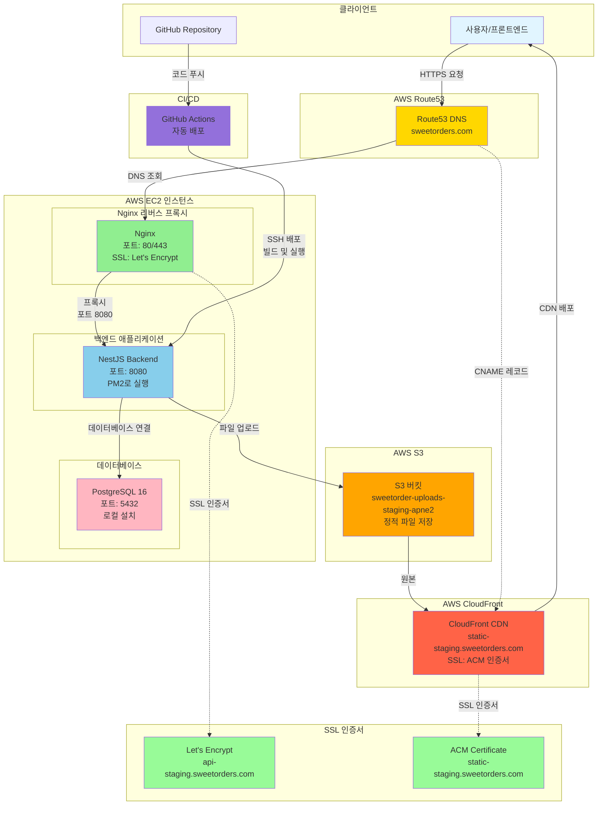

# EC2 배포 - 가이드

## 📋 개요

Sweet Order 프로젝트를 AWS EC2로 배포하는 가이드입니다. 비용 절감을 위해 AWS App Runner 대신 EC2를 사용하며, RDS 대신 EC2에 PostgreSQL을 직접 설치하여 데이터베이스 비용을 절감합니다.

## 📝 1단계: EC2 인스턴스 생성

### 1.1 EC2 인스턴스 시작

1. AWS 콘솔 → EC2 → 인스턴스 시작
2. **이름**: `sweet-order-backend-staging`
3. **AMI**: Amazon Linux 2023 kernel 6.1 (x86_64)
4. **인스턴스 타입**: t3.small
5. **키 페어**: 새 키 페어 생성
   - 키 페어 이름: `sweet-order-backend-key`
   - 키 페어 타입: RSA
   - 프라이빗 키 파일 형식: `.pem`
   - **중요**: `.pem` 파일을 안전하게 보관 (다운로드)
6. **네트워크 설정**:
   - VPC: 기본 VPC 선택
   - 서브넷: 기존 서브넷 중 하나 선택 (새 서브넷 생성 불필요)
     - 기본 VPC에는 보통 여러 가용 영역에 서브넷이 존재함 (예: ap-northeast-2a, ap-northeast-2b, ap-northeast-2c 등)
   - 퍼블릭 IP 자동 할당: **활성화** (필수)

- 보안 그룹: 새 보안 그룹 생성
  - 이름: `sweet-order-backend-sg`
  - 인바운드 규칙:
    - SSH (22): 0.0.0.0/0 (모두허용, github IP 때문)
    - HTTP (80): 0.0.0.0/0 (또는 특정 IP만) - Nginx 사용 시 필수
    - HTTPS (443): 0.0.0.0/0 (또는 특정 IP만) - Nginx 사용 시 필수

7. **스토리지**:
   - 기본값: 8 GiB (초기 테스트용으로 충분)
   - 권장: 20-30 GiB (프로덕션 환경, 데이터베이스 데이터 증가 대비)
   - 스토리지 타입: gp3 (gp2보다 저렴하고 성능 좋음)
   - **참고**:
     - 8 GiB → 30 GiB 확장 시 추가 비용: 약 $2-3/월 (리전별 차이)
8. 인스턴스 시작

### 1.2 Elastic IP 할당

EC2 인스턴스를 중지했다가 재시작하면 퍼블릭 IP 주소가 변경됩니다. Elastic IP를 할당하면 IP 주소가 고정되어 Route53과 GitHub Secrets를 매번 업데이트할 필요가 없습니다.

#### 1.2.1 Elastic IP 할당

1. AWS 콘솔 → EC2 → **Elastic IPs** (왼쪽 메뉴)
2. **Elastic IP 주소 할당** 클릭
3. 설정:
   - **네트워크 경계 그룹**: 기본값 (ap-northeast-2)
   - **퍼블릭 IPv4 주소 풀**: Amazon의 IPv4 주소 풀
4. **할당** 클릭
5. 할당된 Elastic IP 선택 → **작업** → **Elastic IP 주소 연결**
6. 연결 설정:
   - **인스턴스**: `sweet-order-backend-staging` 선택
   - **프라이빗 IP 주소**: 자동 선택
7. **연결** 클릭

#### 1.2.2 Elastic IP 확인

```bash
AWS 콘솔에서 확인
# EC2 → 인스턴스 → sweet-order-backend-staging → 퍼블릭 IPv4 주소
```

## 📝 2단계: EC2 인스턴스 설정

### 2.1 EC2 인스턴스 접속

```bash
# 로컬에서 키가 있는 파일 경로에서 터미널 실행

# 키 파일 권한 설정 (macOS/Linux)
chmod 400 sweet-order-backend-key.pem

# SSH 접속 (SSH 클라이언트에서 예시코드 확인)
ssh -i sweet-order-backend-key.pem ec2-user@<EC2_PUBLIC_IP>
```

### 2.2 시스템 업데이트 및 필수 패키지 설치

```bash
# 시스템 업데이트
sudo dnf update -y

# Node.js 20 설치 (NodeSource 저장소 사용)
curl -fsSL https://rpm.nodesource.com/setup_20.x | sudo bash -
sudo dnf install -y nodejs

# PM2 설치 (프로세스 매니저)
sudo npm install -g pm2

# Prisma CLI 설치 (마이그레이션 실행용) (v6)
sudo npm install -g prisma

# OpenSSL 설치 (Prisma 바이너리 런타임에 필요)
sudo dnf install -y openssl

# PostgreSQL 서버 및 클라이언트 설치
sudo dnf install -y postgresql16-server postgresql16
```

### 2.3 설치 확인

```bash
# Node.js 버전 확인
node --version  # v20.x.x

# PM2 버전 확인
pm2 --version

# Prisma CLI 버전 확인
prisma --version

# PostgreSQL 버전 확인
psql --version
```

## 📝 3단계: PostgreSQL 설치 및 설정

### 3.1 PostgreSQL 초기화 및 시작

```bash
# PostgreSQL 데이터 디렉토리 초기화
sudo postgresql-setup --initdb

# PostgreSQL 시작 및 자동 시작 설정
sudo systemctl enable postgresql
sudo systemctl start postgresql

# PostgreSQL 상태 확인
sudo systemctl status postgresql

# 종료
q
```

### 3.2 데이터베이스 및 사용자 생성

```bash
# PostgreSQL 접속 (postgres 사용자로)
sudo -u postgres psql

# 데이터베이스 및 사용자 생성
-- .env.staging의 DATABASE_URL에서 사용하는 데이터베이스 이름 확인
CREATE DATABASE sweetorder_staging_db;
# .env.staging의 DATABASE_URL에서 사용하는 사용자 이름, 비밀번호 확인
CREATE USER sweetorder_admin WITH PASSWORD 'your_password';
-- 데이터베이스 생성 권한 부여 (Prisma 마이그레이션을 위한 shadow database 생성에 필요)
ALTER USER sweetorder_admin CREATEDB;
-- 권한 부여
GRANT ALL PRIVILEGES ON DATABASE sweetorder_staging_db TO sweetorder_admin;
-- 데이터베이스 소유자 변경
ALTER DATABASE sweetorder_staging_db OWNER TO sweetorder_admin;

# PostgreSQL 버전 확인
SELECT version();

# 종료
\q
```

### 3.3 PostgreSQL 인증 설정 (필수)

Prisma migrate 및 애플리케이션에서 데이터베이스에 접근하려면 PostgreSQL 인증 방식을 변경해야 합니다.

#### 3.3.1 pg_hba.conf 파일 위치 확인

```bash
# pg_hba.conf 파일 경로 확인
sudo -u postgres psql -c "SHOW hba_file;"
```

예상 출력:

```
/var/lib/pgsql/16/data/pg_hba.conf
```

#### 3.3.2 pg_hba.conf 파일 수정

```bash
# pg_hba.conf 파일 편집
sudo vi /var/lib/pgsql/16/data/pg_hba.conf
```

다음 줄을 찾아 수정합니다:

**기존 (❌)**:

```
# IPv4 local connections:
host    all     all     127.0.0.1/32    ident
```

**변경 (✅)**:

```
# IPv4 local connections:
host    all     all     127.0.0.1/32    md5
```

**또는 PostgreSQL 14+ 권장 방식**:

```
# IPv4 local connections:
host    all     all     127.0.0.1/32    scram-sha-256
```

💡 **참고**: 이미 비밀번호가 설정되어 있으므로 `md5` 방식으로도 충분합니다.

#### 3.3.3 PostgreSQL 재시작

```bash
# PostgreSQL 재시작 (필수)
sudo systemctl restart postgresql

# 또는 PostgreSQL 16인 경우
sudo systemctl restart postgresql-16

# 상태 확인
sudo systemctl status postgresql
```

#### 3.3.4 접속 테스트

```bash
# 비밀번호로 접속 테스트 (your_password를 실제 비밀번호로 변경)
PGPASSWORD='your_password' \
psql -h localhost -p 5432 -U sweetorder_admin sweetorder_staging_db
```

성공 시 다음과 같은 프롬프트가 표시됩니다:

```
sweetorder_staging_db=>
```

#### 3.3.5 최종 검증

```sql
-- 테이블 생성 권한 확인
CREATE TABLE test_permission(id int);

-- 테이블 삭제
DROP TABLE test_permission;

-- 성공하면 Prisma migrate가 정상적으로 작동합니다
```

## 📝 4단계: GitHub Actions 자동 CI/CD 설정

GitHub Actions를 사용하여 자동 배포를 구성합니다. 코드를 EC2로 전송하고 직접 빌드 및 실행합니다.

### 4.1 GitHub Actions 워크플로우 파일 생성

- 프로젝트 루트에 `.github/workflows/deploy-staging-backend-ec2.yml` 파일을 생성합니다.
- GitHub 저장소 → Settings → Secrets and variables → Actions에서 다음 Secrets를 설정합니다.

## 📝 5단계: Nginx 리버스 프록시 설정 (권장)

Nginx를 사용하여 80/443 포트로 요청을 받고 백엔드(8080 포트)로 프록시합니다.

**Nginx 사용의 장점**:

- 8080 포트를 외부에 노출하지 않아 보안 강화
- SSL/TLS 인증서 설정 용이 (Let's Encrypt)
- 로드 밸런싱 및 정적 파일 서빙 가능
- 표준 HTTP/HTTPS 포트(80/443) 사용으로 접근성 향상

### 5.1 Nginx 설치

```bash
sudo dnf install -y nginx
sudo systemctl enable nginx
sudo systemctl start nginx
```

### 5.2 Nginx 설정

#### 5.2.1 WebSocket 연결을 위한 map 설정 추가

```bash
# nginx.conf 파일 편집
sudo nano /etc/nginx/nginx.conf
```

`http` 블록 안에 다음 내용 추가 (보통 `http {` 바로 아래):

```nginx
map $http_upgrade $connection_upgrade {
    default upgrade;
    '' close;
}

# 저장 및 종료
ctrl + x → y → enter (/etc/nginx/nginx.conf)
```

#### 5.2.2 서버 설정 파일 생성

```bash
sudo nano /etc/nginx/conf.d/sweet-order-backend.conf
```

설정 내용:

```nginx
server {
    listen 80;
    server_name api-staging.sweetorders.com; # 또는 EC2 퍼블릭 IP

    # 로그 설정
    access_log /var/log/nginx/sweet-order-backend-access.log;
    error_log /var/log/nginx/sweet-order-backend-error.log;

    # 클라이언트 최대 바디 크기 (파일 업로드용)
    client_max_body_size 10M;

    # Socket.IO WebSocket 연결 (Socket.IO는 /socket.io/ 경로 사용)
    location /socket.io/ {
        proxy_pass http://localhost:8080;
        proxy_http_version 1.1;
        proxy_set_header Upgrade $http_upgrade;
        proxy_set_header Connection "upgrade";
        proxy_set_header Host $host;
        proxy_set_header X-Real-IP $remote_addr;
        proxy_set_header X-Forwarded-For $proxy_add_x_forwarded_for;
        proxy_set_header X-Forwarded-Proto $scheme;

        # WebSocket 타임아웃 설정 (Socket.IO 장시간 연결 유지)
        proxy_read_timeout 86400s;
        proxy_send_timeout 86400s;
    }

    # Health check는 직접 전달 (로그 제외)
    location /health {
        proxy_pass http://localhost:8080/health;
        proxy_set_header Host $host;
        access_log off;
    }

    # 일반 API 요청 프록시
    location / {
        proxy_pass http://localhost:8080;
        proxy_http_version 1.1;
        proxy_set_header Host $host;
        proxy_set_header X-Real-IP $remote_addr;
        proxy_set_header X-Forwarded-For $proxy_add_x_forwarded_for;
        proxy_set_header X-Forwarded-Proto $scheme;

        # WebSocket 업그레이드 지원 (일반 HTTP 요청에서도 WebSocket으로 업그레이드 가능)
        proxy_set_header Upgrade $http_upgrade;
        proxy_set_header Connection $connection_upgrade;
    }
}

# 저장 및 종료
ctrl + x → y → enter
```

### 5.3 Nginx 재시작

```bash
sudo nginx -t  # 설정 파일 검증
sudo systemctl restart nginx
```

## 📝 6단계: Route53 DNS 설정

EC2 인스턴스를 도메인(`api-staging.sweetorders.com`)에 연결합니다.

### 6.1 EC2 퍼블릭 IP 확인

EC2에 SSH 접속하여 퍼블릭 IP를 확인합니다:

```bash
# EC2 퍼블릭 IP 확인
169.254.169.254

# 또는 AWS 콘솔에서 확인
# EC2 → 인스턴스 → 퍼블릭 IPv4 주소
```

### 6.2 Route53 호스팅 영역 확인

1. AWS 콘솔 → Route53 → 호스팅 영역
2. `sweetorders.com` 호스팅 영역 선택

### 6.3 A 레코드 생성

1. Route53 → 호스팅 영역 → `sweetorders.com` → **레코드 생성** 클릭
2. 레코드 설정:
   - **레코드 이름**: `api-staging` (서브도메인)
   - **레코드 타입**: `A - IPv4 주소와 라우팅 트래픽을 리소스로 라우팅`
   - **값**: EC2 퍼블릭 IP (6.1에서 확인한 IP)
   - **TTL**: `300` (5분) 또는 기본값
   - **라우팅 정책**: 단순 라우팅
3. **레코드 생성** 클릭

### 6.4 DNS 전파 확인

레코드 생성 후 DNS 전파를 확인합니다:

```bash
# 로컬 터미널에서 확인 (EC2에서 나와서)
nslookup api-staging.sweetorders.com

# EC2 퍼블릭 IP와 일치하는지 확인
```

### 6.5 도메인 연결 확인

```bash
# 브라우저에서 접속
http://api-staging.sweetorders.com/health
```

## 📝 7단계: SSL 인증서 설정 (Let's Encrypt)

HTTPS를 사용하려면 SSL 인증서를 설정합니다. **6단계 DNS 설정이 완료되어야 합니다.**

### 7.1 Certbot 설치

```bash
sudo dnf install -y certbot python3-certbot-nginx
```

### 7.2 SSL 인증서 발급

```bash
sudo certbot --nginx -d api-staging.sweetorders.com
```

**중요**:

- 도메인이 EC2를 가리키고 있어야 합니다 (6단계 완료 필수)
- 보안 그룹에서 80, 443 포트가 열려 있어야 합니다
- Nginx가 실행 중이어야 합니다

**프롬프트 안내**:

- 이메일 주소 입력: 인증서 갱신 알림용
- Terms of Service 동의: `A` 또는 `Y`
- 이메일 공유 동의: 선택사항 (`Y` 또는 `N`)

### 7.3 SSL 인증서 자동 갱신 설정

Let's Encrypt 인증서는 90일마다 갱신이 필요합니다. 자동 갱신이 이미 설정되어 있지만, 테스트를 권장합니다:

```bash
# 자동 갱신 테스트
sudo certbot renew --dry-run

# 자동 갱신 cron 작업 확인 (보통 자동으로 설정됨)
sudo systemctl status certbot.timer
```

### 7.4 HTTPS 확인

```bash
# HTTPS로 접속 확인
curl https://api-staging.sweetorders.com/health

# 또는 브라우저에서 접속
https://api-staging.sweetorders.com/health
```

## 8. AWS S3(정적), CloudFront(CDN) 설정

일반 파일 저장(이미지/파일 업로드·배포) 목적

### 1. AWS S3 버킷 생성

1. AWS > S3 > 버킷 생성

- 버킷 유형: 범용
- 버킷 이름: sweetorder-uploads-staging-apne2
- 객체 소유권: ACL 비활성화됨
- 모든 퍼블릭 액세스 차단
- 버전 관리 OFF
- 기본 암호화 유형: SSE-S3
- 버킷 키: 비활성화

2. 프론트엔드 CORS 설정

2-1. AWS > S3 > 생성한 버킷 클릭 > 권한 탭 > CORS부분 아래 코드 삽입

```json
[
  {
    "AllowedOrigins": [
      "http://localhost:3001",
      "http://localhost:3002",
      "http://localhost:3003",
      "https://staging.sweetorders.com",
      "https://seller-staging.sweetorders.com",
      "https://admin-staging.sweetorders.com"
    ],
    "AllowedMethods": ["GET", "HEAD", "PUT", "POST"],
    "AllowedHeaders": ["*"], // 전체 허용
    "ExposeHeaders": ["ETag"], // 업로드 후 파일 확인용
    "MaxAgeSeconds": 3000
  }
]
```

3. S3_BUCKET, CLOUDFRONT_DOMAIN 등 환경 변수 저장

4. 백엔드에서 @aws-sdk/client-s3 설치 후 파일 업로드 API 구현

### 2. CloudFront 생성

1. AWS > CloudFront > 배포 생성

- 1단계
  - Distribution name: sweetorder-static-staging
  - Distribution type: Single website or app
  - Domain: (생략)
- 2단계
  - Origin type: Amazon S3
  - Origin: browse S3 버튼 클릭 > 해당 버킷 선택(sweetorder-uploads-{환경}-apne2)
  - Origin path: (생략)
  - Settings: 선택되어 있는 상태 유지
- 3단계
  - Web Application Firewall: 보안 보호 비활성화

2. 정책 복사 및 저장
   - 2-1. 생성한 배포 클릭 > origin(원본) 탭 > 해당 origin 선택 후 편집 > 정책 복사 버튼 클릭
   - 2-2. AWS > S3 > sweetorder-uploads-{환경}-apne2 버킷 클릭 > 권한 탭 > 버킷 정책 편집 > CloudFront에서 복사한 정책을 JSON 편집기에 붙여넣기 > 저장

3. (SSL 인증서 요청) AWS > Certificate Manager > 인증서 요청 (4단계까지 완료후 발급될때까지 기다려야함)

- (us-east-1)
- 인증서 유형: 퍼블릭 인증서 요청
- 도메인 이름: static-staging.sweetorders.com
- 내보내기: 내보내기 비활성화
- 검증 방법: DNS 검증
- 키 알고리즘: RSA 2048

4. (DNS 레코드 생성) AWS > Route53 > 호스팅 영역 > sweetorders.com > 레코드 생성 > Type: CNAME, 위 3번에서 발급된 값 입력 > 생성

5. (CloudFront에 SSL 인증서 연결) AWS > CloudFront > 생성한 배포 클릭 > 편집

- Alternate domain names (CNAMEs): (항목 추가) static-staging.sweetorders.com
- Custom SSL certificate: 드롭다운에서 발급된 인증서 선택

6. (커스텀 도메인이 CloudFront Distribution을 가리키도록 설정)
   - 6-2. AWS > CloudFront > 생성한 배포 클릭 > General 탭 > 대체 도메인 이름 아래 "Route domains to CloudFront" 버튼 클릭 > Set up routing automatically 클릭

---

## 📊 전체 아키텍처 다이어그램


